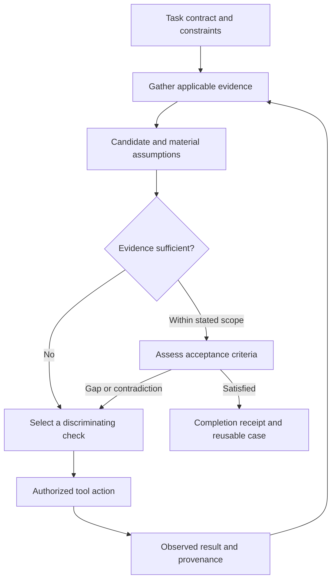
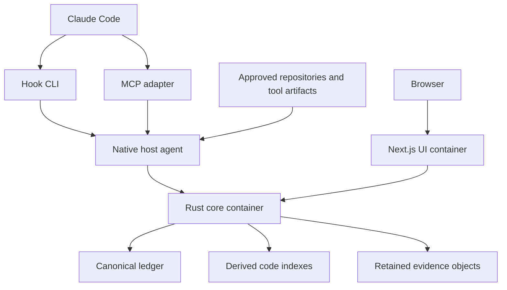

# Evidence-Guided Memory and Problem Solving for Claude Code

**Status:** Current as the research and evidence-model reference; superseded on stack selection.
**Superseding document:** [Kioku Architectural Plan](kioku-architectural-plan_v1.md), 15 September 2026, referred to below as **Plan**.
**Revised:** 15 September 2026 — supersession marked; no research content changed.

The evidence model, task-contract model, research synthesis and evaluation design in this document remain governing. The **implementation stack does not.** The Plan selects Ruby on Rails, PostgreSQL with ParadeDB, Sidekiq/Redis and Docker Compose in place of the Rust core and SQLite ledger proposed here. Passages carrying the superseded stack are marked inline **[Superseded → Plan §n]**; the surrounding requirement usually survives the substitution, and the marker says which part does not.

Two **capability** decisions are also recorded inline and are not stack substitutions. Embeddings, vector and hybrid retrieval and ANN are **removed from scope** (§§1, 4, 5, 15, 17) — not deferred, not gated by measured benefit; this release does not address semantic recall. Arabic normalization is **dropped as a requirement** (§9). Each marker says which kind of change it records.

Section and appendix numbering is fixed. The Plan cites this document by number in ten places, and renumbering would silently break those references.

The SQL excerpts in Appendices A, C and D are **semantic specifications** — identities, constraints, state machines, coverage and publication rules — expressed in SQLite dialect. Translate their meaning to PostgreSQL; do not implement their dialect. Where SQLite's single-writer model is load-bearing in the prose, the marker says so, because PostgreSQL's concurrent writers change the obligation rather than remove it.

## 1. Recommended system and expected benefit

Build a local application that connects **task continuity, code intelligence, solution discovery, and verification** through one evidence model. Its job is to help Claude recover relevant history, identify what remains unknown, compare plausible fixes, obtain useful observations, and report what those observations actually establish.

The recommended foundation is a native Rust host agent and thin Claude Code adapters, a Docker Compose deployment containing a Rust core and a Next.js/shadcn management UI, a canonical SQLite ledger, rebuildable repository indexes, and retained evidence objects. Exact lookup, FTS5, and bounded typed graph traversal form the default retrieval path. Embeddings and precise language resolvers remain optional extensions.

> **[Superseded → Plan §1, §5.4]** The Plan keeps thin host adapters, Compose, the Next.js/shadcn UI, a canonical ledger, rebuildable indexes and retained evidence objects. It replaces the Rust core with a Rails API service, the SQLite ledger with PostgreSQL, and FTS5 with ParadeDB. Embeddings do not move from optional extension to anything — they are **removed from scope**, along with vector and hybrid retrieval and ANN, so the "optional versioned vector indexes" in the decision table below have no counterpart in the Plan. ParadeDB supplies the lexical/BM25 leg and the columnar analytics on its own; precise language resolvers and rerankers stay conditional exactly as this document has them. The retrieval shape — exact lookup first, then lexical, then bounded traversal — is unchanged.

The largest expected accuracy benefit comes from retaining information that is otherwise easily lost: the current objective, governing constraints, rejected attempts, user corrections, observed outcomes, and reasons a proposed solution remains uncertain. Code indexing grounds that information in the implementation. A new task-and-verification layer connects it to the next useful action.

This improves the information and workflow available to an LLM. It does not update the model's parameters, provide privileged access to its attention, or guarantee sound inference. Retrieved evidence must reach the model through context or tool results, and the model can still misunderstand correct evidence. OpenAI's accuracy guidance distinguishes inadequate context from failures to use available context; both require evaluation.[^1]

The system should optimize **successfully completed tasks with fewer unsupported claims and less repeated investigation**, then minimize total tokens and elapsed time within that requirement. There is no established universal token-saving percentage, optimal graph engine, or guaranteed accuracy increase for this application. Performance budgets below are proposed engineering targets, and research findings are evidence for mechanisms rather than measured results for this implementation.

| Decision | Recommended baseline |
|---|---|
| Product | Persistent memory, source grounding, candidate discovery, and scoped verification in one system |
| Deployment | Claude on macOS or Linux/WSL; native Rust bridge; Rust core and Next.js UI in Compose **[Superseded → Plan §3.1: Ruby host adapters; `db`, `redis`, `migrate`, `api`, `worker`, `ui` services]** |
| Canonical authority | One installation ledger for accepted records, evidence metadata, task contracts, and mutation receipts |
| Derived storage | One rebuildable code database per repository; optional versioned vector indexes |
| Retrieval | Exact identifiers, lexical search, bounded graph neighborhoods, progressive evidence fetch |
| Context delivery | Small changed-state capsule plus explicit pull through six MCP tools |
| Solution generation | Claude proposes candidates using retrieved cases, code, and optionally external sources |
| Verification | Existing authorized tools produce observations; core checks their scope and completeness |
| Proactivity | Detect known gaps, prefetch evidence, and suggest useful checks; execution stays in the normal agent workflow |
| Initial exclusions | No synchronous hook inference, automatic repository execution, compulsory embedding model, or whole-graph prompt dump |

Native `CLAUDE.md`, scoped rules, and Claude's own memory remain supported. Give them an explicit role: human-maintained instructions and provider-native convenience. The ledger retains versioned evidence and task history. Avoid automatically synchronizing every dynamic observation into both stores, which can create duplication and conflicting copies.[^2]

## 2. What the research supports

The research favors a bounded loop of retrieval, action, observation, and revision. It gives less support to the idea that storing more text or asking a model to reconsider itself is sufficient for reliability.

| Primary research | Relevant finding | Architectural use and limit |
|---|---|---|
| ReAct | Interleaves reasoning, tool actions, and environmental observations in evaluated tasks | Let Claude select a useful action and update a concise task record from its result. This is a workflow pattern, not a guarantee about modern coding agents.[^3] |
| Reflexion | Retains linguistic feedback and episodic memory to inform later attempts without changing model weights | Preserve outcomes and bounded lessons from rejected attempts. Keep an actual tool observation separate from the model's interpretation.[^4] |
| Self-Refine | Finds benefits from iterative model-generated feedback on several tasks | Permit a bounded critique step when it can identify a concrete improvement or check. Critique remains a proposal.[^5] |
| Intrinsic self-correction study | Finds that correction without external feedback can fail or degrade reasoning in its tested settings | Do not treat a repeated answer or a second agent's agreement as validation. The paper does not establish that every self-correction method fails.[^6] |
| Self-RAG | Trains models to retrieve selectively and assess relevance and support | Borrow the separation of retrieval need, relevance, and support. Its trained reflection-token mechanism cannot be reproduced merely by installing Claude hooks.[^7] |
| Corrective RAG | Evaluates retrieved evidence and changes retrieval strategy, including broader search, when needed | Detect insufficient local evidence and try a different query or an optional external source. A retrieval-quality score is not a probability that a fix is correct.[^8] |
| SWE-agent | Shows that the agent's interfaces for navigating, editing, and testing influence software-task performance | Make exact evidence fetch, structured outcomes, and failure messages easy to use. Better storage alone does not fix an awkward action interface.[^9] |
| Lost in the Middle | Finds sensitivity to evidence position in long contexts for tested models and tasks | Evaluate capsule size, placement, and noise. Do not assume a fixed attention law or token optimum for current models.[^10] |

These studies use different models, tasks, protocols, and dates. Self-Refine and the intrinsic-correction study are a useful tension: self-feedback can help under some conditions, but its value cannot be presumed for a new workflow. The proposed default is **one useful critique when needed, followed by new evidence**, rather than an unbounded reflection loop.

Temporal-memory systems such as Zep/Graphiti offer relevant precedent for validity intervals and provenance. Their published memory benchmarks do not establish code correctness, a preferred local database, or expected savings for Claude Code.[^11][^12] Aider's repository map is a useful comparator for graph-guided context selection under a budget.[^13]

The resulting recommendation is an engineering synthesis: keep deterministic bookkeeping and source checks outside the model; use the model for interpretation and candidate generation; seek observable feedback for material uncertainties. None of the cited methods makes semantic relevance equivalent to truth.

## 3. The complete problem-solving loop

A task starts with an objective and ends with an attributable assessment against explicit criteria. Memory participates throughout; it is not merely a summary written after the agent stops.



The loop has seven responsibilities:

1. **Frame:** record the requested outcome, constraints, source scope, and acceptance criteria.
2. **Recover:** retrieve relevant decisions, failed attempts, code, and prior observations.
3. **Explain provisionally:** identify the proposed mechanism and material assumptions.
4. **Discover:** find existing solution cases or synthesize a small set of candidates.
5. **Discriminate:** choose evidence that could change the decision, including contrary evidence.
6. **Observe:** capture the actual result, source inputs, environment, and limitations.
7. **Assess and retain:** establish which criteria are supported and preserve a bounded lesson.

Simple tasks can use one candidate and one appropriate check. Ambiguous bugs may need two or three meaningfully different candidates. Do not manufacture alternatives, essays, or tests for every trivial edit. The working record contains concise public conclusions and references; private chain of thought is neither required nor a supported capture contract.

A checkpoint should answer: what outcome is being pursued, what is known, what is still assumed, what happened last, and what check would most usefully change the decision. “Next: keep investigating” is insufficient when a specific uncertainty is already known.

The core can identify structured gaps: a required criterion with no observation, a stale source dependency, a changed contract, an unresolved contradiction, or a failed attempt whose retry condition is unchanged. It cannot enumerate every unknown in a program. Semantic gap detection can be proposed by Claude, but remains fallible and is recorded as an assessment rather than a discovered fact.

## 4. Runtime architecture and implementation stack

> **[Superseded → Plan §3, §4]** This section's *runtime choices* are replaced wholesale; its *responsibilities, trust boundaries and transport constraints* are retained. The four component names (`contextctl`, `context-mcp`, `context-agent`, `context-core`) survive as role names, with `context-core` becoming the Rails API + Sidekiq worker sharing one backend image, and the first three becoming lightweight Ruby host adapters that do not boot Rails on the hook path. The private host socket, the loopback core bridge, the rule that hooks never `docker exec` or scan, and the separation of latency-sensitive control messages from bulk transfer all stand unchanged. Read the tables below for *what each component owes*, not for what it is written in.

### Components and transport

| Component | Runtime | Responsibility |
|---|---|---|
| `contextctl` | Native Rust CLI | Thin hook dispatch, operator commands, bounded JSON transport |
| `context-mcp` | Long-lived native Rust process | Six MCP tools over stdio; request and receipt correlation |
| `context-agent` | Persistent native Rust service | Approved roots, source manifests, file watching, host validation, durable spool |
| `context-core` | Rust container | Canonical ledger, task state, retrieval, evidence assessments, jobs, API |
| Management UI | Next.js/shadcn container | Task workspace, memory management, evidence inspection, operations |
| Worker pool | Bounded workers within the core | Parsing, reconciliation, projections, optional later enrichment |



CLI and MCP traffic reach the host agent through a private host Unix socket. The agent uses authenticated connections to a core port published on loopback. The socket stays on the host; it is not shared across Docker Desktop's VM boundary. Proposed ports are `127.0.0.1:7310` for the core bridge and `127.0.0.1:7311` for the UI. Next.js reaches the core through the Compose network.[^14]

Hooks never invoke `docker exec`, launch a model, run a parser, or scan the repository. The UI can stop without interrupting Claude integration. Keep latency-sensitive control messages separate from bulk object transfer so a large log cannot block a prompt query.

### Selected libraries and ownership

> **[Superseded → Plan §4.2]** The library slate below is Rust-specific and no longer selected. What carries forward is the *selection discipline*: pin every version and native build input, keep one owner per concern, and qualify beta or version-dependent features before release. Tree-sitter survives as the parser family; BLAKE3 survives as content addressing; the rest have Ruby/PostgreSQL counterparts chosen in the Plan.

Use `rmcp`, `rusqlite`, Tree-sitter, a bounded Rayon pool, `notify`, `ignore`, `gix`, and BLAKE3. Pin their versions and native build inputs. `rmcp` supplies the official Rust MCP implementation; the other libraries provide SQLite access, parsing support, parallelism, filesystem integration, and content addressing.[^15][^16][^17][^18][^19]

Rust is recommended for deployment simplicity, native integration, and resource control. No assumption is made that every binary is fully static or that only Rust can meet the latency target. A thin Go client could also be viable; introducing several runtime languages into the hot path has no demonstrated benefit here. Python remains suitable for an optional evaluation or model worker, and Next.js belongs in the management surface.

The core has modules for identity/scope, ingest/objects, memory, task contracts and checks, code indexing, retrieval, awareness, accounting, and scheduling. These are code boundaries, not separate services. One writer owns each database; parsing, ranking, source I/O, and model work occur outside write transactions.

Reserve foreground capacity for retrieval, source validation, and small canonical mutations. Bound background concurrency, object size, query fanout, and export work. Worker leases and cancellation must prevent obsolete indexing work from overwriting newer state.

### Reuse strategy

Use libraries for storage and parsing; implement the evidence and task coordination layer. Claude-Mem is a memory UX comparator, Context Mode and RTK are output-retention/reduction comparators, and Serena is a possible semantic-navigation adapter.[^20][^21][^22][^23] Compare each independently. Installing all of them together is not the architecture.

SQLite remains the default. Reconsider a dedicated vector or graph engine only for a measured workload that the baseline fails to serve.

> **[Superseded → Plan §5.1, §5.4]** PostgreSQL with ParadeDB is the default store. The *argument* is unchanged and now discharged differently: one database serves exact lookup, lexical/BM25 retrieval and columnar aggregation, so no separate search cluster is planned. The sentence above is settled in the other direction too — vector search is not an extension awaiting a measured workload, it is **out of scope**, so no dedicated vector engine is planned either. The obligation to qualify version-dependent and beta features before release is not affected by that removal and stands as written; it now attaches to the ParadeDB search features actually relied on. The original stack-graphs and Kuzu repositories are archived and should not be new default dependencies.[^24] This maintenance decision does not imply that every graph database or successor project is unsuitable.

## 5. Persistence, evidence, and the meaning of truth

### Canonical and derived ownership

| Store | Contents | Durability policy |
|---|---|---|
| `memory.sqlite` **[→ Plan §5.1: PostgreSQL, one database, project/global namespaces]** | Identities, events, evidence metadata, memory revisions, task contracts, candidates, checks, disputes, receipts | Canonical; WAL with `synchronous=FULL` |
| Canonical search projections | Current memory, task, and retained-case search documents | Updated transactionally; rebuildable |
| Repository code databases | Source mappings, symbols, occurrences, lexical chunks, typed code edges, coverage | Rebuildable; WAL `NORMAL` can be acceptable |
| Content-addressed objects | Retained source, test reports, public handoffs, permitted tool output | Durable bytes before public evidence references |
| Optional vector indexes | Model-specific embeddings and ANN structures | Derived; replaceable generation manifests |
| Host spool | Unacknowledged events and pending object uploads | Bounded replay queue; not an editable memory store |

Keep container-owned data in a named volume. Approved source is ingested through the host agent by default; a read-only bind-mount profile can be separately qualified. Docker documents persistent-volume and WSL filesystem considerations.[^25][^26]

SQLite allows one writer per database with concurrent readers in WAL mode. `NORMAL` can lose committed transactions after a power/system failure even while maintaining consistency, so use `FULL` for non-reconstructable accepted memories and task records.[^27][^28] Bundle a maintained SQLite build containing the WAL-reset fix introduced in 3.51.3 or a verified patched branch.[^29] Lock waits must fit the request deadline; a five-second busy timeout does not belong on a 150 ms hook path.

> **[Superseded → Plan §4.2, §5.1]** This paragraph is the one place where the stack change alters an *obligation* rather than a name, so read the substitution carefully.
>
> PostgreSQL supports concurrent writers. The single-writer serialization that this document relied on to order canonical mutations is **gone, and was doing real work** — it made "one writer owns each database" free. Under PostgreSQL that guarantee must be re-established explicitly, through transactions, row-level locking, expected-revision checks and uniqueness constraints. Every invariant this document states about revision ordering, idempotency keys and outbox publication still holds; only the mechanism that enforced them changes, and it now has to be written down rather than inherited from the engine.
>
> The ORM is named, and it is the only one: **Active Record with the `pg` adapter**. Schema changes go through Active Record migrations; PostgreSQL-specific constraints, search indexes and functions land via `structure.sql`. There is no second ORM, no raw-SQL data layer and no repository framework layered over Active Record. That is also where the re-establishment above has to be done — the ordering guarantees this document inherited free from SQLite's single-writer model are reconstructed out of Active Record transactions, explicit row locks, optimistic expected-revision checks and database uniqueness constraints, not out of the engine's concurrency model.
>
> The "Optional vector indexes" row in the table above has no counterpart in the Plan: embeddings and ANN structures are out of scope, so that derived store does not exist and its generation manifests are not something to build. See the §15 marker for what was and was not established before the capability was dropped.
>
> The durability tuning (`synchronous=FULL`, WAL mode, the 3.51.3 fix) is SQLite-specific and does not carry over; PostgreSQL's equivalent is its own `synchronous_commit` and WAL configuration, qualified separately. The deadline discipline in the last sentence is **not** superseded and is arguably more important now: a lock wait that does not fit the request deadline is a worse failure against a networked database than against a local file.

Commit canonical changes and outbox jobs together. Publish derived repository transactions separately, then record receipts. There is no cross-database atomicity claim. Jobs carry input identities, configuration versions, deletion epochs, and expected publication generations. A late job is discarded or retained historically.

Persist and sync object bytes and their directory entry before committing an available-object handle. A durable host enqueue means “queued”; an explicit memory/task write reports “saved” only after canonical commit. Staging objects are not advertised as fetchable evidence.

### A record can be authentic and still be wrong

The ledger is authoritative about accepted records and their history. Behavioral truth requires suitable evidence and interpretation. Keep these dimensions distinct:

| Dimension | Example |
|---|---|
| Authority | Direct user policy, assistant hypothesis, tool observation, imported source |
| Lifecycle | Proposed, active, superseded, retracted |
| Availability | Available, redacted, missing, expired |
| Applicability | Source checked, historical, stale, environment mismatch, unknown |
| Claim support | Unassessed, supported within scope, contradicted, inconclusive |
| Coverage | Complete for a declared input set, partial, unknown |

A matching file hash establishes a relationship to bytes. It does not establish that a sentence about those bytes is correct. A passing test supports the cases and assertions that actually ran. A user decision establishes intended policy; it does not prove the implementation follows it. A retrieved official document describes its documented version, not necessarily the installed dependency.

Use valid time and recorded time independently. Immutable revisions preserve what was believed and when. Source applicability and semantic support are separate assessments with their own inputs and timestamps. Do not collapse them into one “verified” boolean or an uncalibrated confidence float.

### Provenance and independent support

Represent evidence derivation explicitly: `derived_from`, `observed_in`, `authored_by`, `supports`, and `contradicts`. W3C PROV-O provides a useful vocabulary of entities, activities, agents, and derivation; adopting the concepts does not require RDF, OWL, or another database.[^30]

Three agents repeating one summary provide one shared evidence lineage, not three independent confirmations. A test rerun is a new observation but can retain shared blind spots through the same assertions and fixtures. Track root artifacts, summaries, transformations, execution runs, and verifier versions; leave independence unknown where the lineage is incomplete.

Do not turn injected packets into fresh evidence for themselves. Retrieved text and agent agreement can guide investigation, but cannot create a circular support chain. Detect lineage cycles and repeated roots; never convert a count of endorsements into a probability of correctness.

## 6. Task contracts, claims, checks, and completion

### Versioned task contract

A task contract is the working definition of success. It contains the objective, approved repository/worktree scope, constraints to preserve, acceptance criteria, known exclusions, and the origin of each requirement. Derive it from the existing request and repository instructions; do not require a new confirmation for routine implementation choices.

| Record | Required content |
|---|---|
| Task contract | Stable task ID, immutable revision, objective, scope, origin event, constraint references |
| Acceptance criterion | Observable expectation, required/optional status, source of authority, verification policy |
| Material claim | Statement, assumptions, relevant subjects, supporting and conflicting evidence, assessment |
| Candidate version | Proposed mechanism, expected effect, preconditions, changes, risks, rejection/retry conditions |
| Planned check | Criterion and candidate links, expected inputs/environment, verifier definition, expected distinguishing outcomes |
| Observation | Actual event/artifact, executed cases, results, source/environment identity, input assurance |
| Completion receipt | Contract revision, assessed source scope, evidence vector, satisfied/unresolved criteria, limitations |

Explicit user requirements remain distinct from agent-inferred criteria. If an inferred criterion is wrong, revise it with attribution. An agent cannot satisfy a user requirement by silently deleting it or changing the expected result after a failure. Contract changes use expected-revision checks and preserve the previous definition and its observations.

Task state records `investigating`, `implementing`, `checking`, `blocked`, `completed_in_scope`, or `interrupted` as an attributable working status. It is separate from a user's acceptance of the result. A session stopping, a commit landing, or an agent writing “done” does not by itself complete the task.

### Material claims and evidence sufficiency

Record claims that could change the implementation choice or completion verdict. Examples include “retries can overlap,” “this schema is consumed by both mobile clients,” and “the old fix failed because the serializer re-queried.” Avoid turning every sentence into a graph node.

For each material claim ask: which observation supports it, under what conditions, what alternative explanation remains, and what would contradict it? The answer can be a short structured assessment. Semantic judgments remain attributed to the human, agent, or qualified analyzer that made them; the database does not independently understand their truth.

The claim “the worker is safe under retries” is broader than “a sequential retry test passed.” The latter may support one acceptance criterion while leaving concurrency, crash recovery, and external effects unresolved. The system should expose that difference even when both statements cite unchanged source files.

### Verification adapters

Checks run through the agent's existing authorized tool workflow. The memory core proposes and records checks; it does not acquire a new default power to execute repository commands. A verification adapter normalizes observations already produced by a compiler, test runner, analysis tool, or explicit inspection.

Correlate a planned check with a real tool event and retained report using qualified run IDs, output manifests, tool-use receipts, or supported adapter metadata. An agent can suggest the association, but cannot manufacture `pass` by supplying that label. Validate the artifact, scope, run identity, and known execution fields. If correlation or interpretation is incomplete, retain an unlinked or unknown observation.

| Verification method | Useful evidence | Limit |
|---|---|---|
| Exact source/schema inspection | A declaration, constraint, mapping, or configuration exists in a checked snapshot | Existence alone does not prove behavior |
| Existing regression/integration test | Named assertions and results for a specific run | Can miss the defect or use unrepresentative fixtures |
| Compiler/typechecker/analyzer | Supported static properties under a recorded configuration | Successful analysis is not full task correctness |
| Property-based testing | Generated cases that challenge a stated invariant, with minimized counterexamples | Quality depends on the property and generator; Proptest is a suitable Rust-core option[^31] **[Tool superseded → Ruby equivalent selected in Plan §11 Phase 0; the method is unchanged]** |
| Targeted mutation testing | Whether selected deliberate defects are detected by tests | Surviving/equivalent mutations require interpretation; cargo-mutants is an optional Rust test-quality tool[^32] **[Tool superseded → Ruby equivalent; the method is unchanged]** |
| Constraint solving | Satisfiability or counterexamples for a formalized bounded problem | A tool such as Z3 proves properties of the encoded model, not unmodeled application behavior[^33] |
| Human review | Explicit acceptance of a design tradeoff or observable requirement | Preserve the reviewer, scope, and rationale; do not relabel it as an execution result |

Use the project's existing framework first. Ruby/Rails checks run in the qualified Ruby/database environment; Dart checks use the relevant package/Flutter configuration; Swift checks use the required toolchain and platform. A Linux memory container cannot supply native iOS/Xcode verification merely because the source is indexed.

Capture source and test-definition identities, dependency/configuration fingerprints, command/runner version, executed case IDs, result counts, exit status, and artifacts. Record failed, skipped, timed out, interrupted, infrastructure-error, and unknown states separately. Exit zero with no intended cases executed cannot satisfy a behavioral criterion.

A test's source inputs need an explicit assurance level. An immutable input snapshot gives stronger binding than hashes observed before and after a run. Bookend hashes can miss intermediate changes and uncontrolled external inputs. Preserve the observation's assurance level and apply the criterion's declared policy; never silently call a mutable run a hermetic one.

### Completion assessment

`context_task(action='assess')` returns a criterion-by-criterion assessment with evidence and gaps. The deterministic part checks identity, availability, contract revision, source/environment compatibility, input assurance, verifier definition, executed scope, and unresolved structured blockers. The semantic part assesses whether the evidence addresses the requirement and is explicitly attributed.

A completion receipt requires at least one applicable required criterion, adequate evidence for every required criterion, no unresolved material contradiction, and a recorded treatment of known limitations. Unknown, skipped, irrelevant, stale, or mismatched observations do not count as passing evidence. A contract with no criteria is unassessed, not vacuously complete.

The receipt says **completed within this contract, source state, and evidence scope**. It cannot establish absence of all unknown defects. Changing a relevant source, requirement, verifier, dependency, or environment can make that receipt historical. Reassessment can reuse unchanged applicable evidence; it need not rerun every test indiscriminately.

Enforce these rules on the system's task state and completion API. Ordinary hooks cannot guarantee that an LLM never writes an unsupported completion claim in free text. A nonblocking Stop hook records any mismatch and leaves an incomplete task recoverable; repeatedly forcing the agent to continue is not the default recovery mechanism.

## 7. Finding and comparing solutions

### Retrieval supplies candidates; the model supplies new synthesis

`context_search(mode='solutions')` retrieves prior attempts, retained procedures, relevant code patterns, and supporting artifacts. It can identify an applicable known case or explain why a previous approach should not be repeated. It does not invent a correct new fix through a database query.

Claude synthesizes a new candidate when existing cases are insufficient. Record the proposed mechanism, evidence, assumptions, and discriminating check before treating the candidate as supported. A compact candidate card is more useful than a long confident solution narrative with no testable claim.

| Candidate field | Purpose |
|---|---|
| Problem and mechanism | Explain what is believed to cause the behavior and how the change addresses it |
| Preconditions | Identify framework versions, state, schema, workload, and constraints required for applicability |
| Supporting evidence | Link the exact code, prior case, observation, or external reference |
| Contrary evidence | Preserve known failures and alternative explanations |
| Change scope | Identify affected subjects, contracts, and likely consumers |
| Discriminating check | State what observation would favor or reject this approach |
| Verdict and retry conditions | Prevent repetition of a failed approach under unchanged conditions |

Search local sources in this order: exact error/path/symbol and current task; relevant rejected attempts and decisions; structurally related implementation/tests; compatible retained solution cases; then broader lexical or optional semantic recall. Retrieval order is a default policy, not a requirement to issue five calls on every task.

> **[Substitute → Plan §5.4]** The final step is broader lexical retrieval. Optional semantic recall is out of scope, so the order terminates one step earlier than written. The ordering discipline and the limit it carries — this is a default policy, not an instruction to issue five calls on every task — are unchanged.

A similar past symptom is insufficient for reuse. Match preconditions and dependencies. A solution for an older framework, a different database, or a sequential workload may be a useful hypothesis while failing present applicability. Keep contradictory cases available in solution mode even when they would be excluded from an ordinary factual capsule.

### Optional external research

Local-first operation can escalate to external sources when the required information is absent, incomplete, or version-dependent. The default deployment needs no continuous web observer. External discovery occurs through Claude's available authorized research tools or a separately enabled provider, with its own time, token, and network budget.

Prefer installed-source documentation and version-matched official documentation first, then maintainer issue discussions, source repositories, and relevant research papers. Record canonical URL, document/release version, retrieval time, retained permitted excerpt, query purpose, and relation to the candidate. An unresolved issue or an example from a newer release is not an established fix for the installed version.

Queries should disclose only necessary public error signatures or generic mechanisms; private code and retained conversations are not automatically exported to search providers. Imported material remains external evidence. It cannot override active instructions, issue commands on its own authority, or become a user correction.

If external search is disabled or unavailable, return the precise gap and a local next check where possible. Do not invent a documentation result. Novel solution generation remains possible through Claude's reasoning, but its output retains hypothesis status until suitable evidence exists.

### Choosing the next useful check

Prioritize checks that could change the candidate choice or completion verdict. Use explicit ordinal factors: decisiveness, affected requirement, feasibility, latency, token cost, and execution scope. Do not present a numerical “information gain” as calibrated unless the system has an actual probabilistic model and evaluation for it.

A cheap source or schema check can eliminate a candidate before an expensive integration run. A concurrency test can distinguish two approaches that both pass sequential tests. Another broad repository search is low value when the remaining uncertainty concerns a specific runtime behavior.

Set per-task investigation budgets and stop conditions. If two iterations repeat the same evidence and candidate, expose the lack of progress. Escalate by changing the evidence source, narrowing the uncertainty, requesting a missing requirement when it truly matters, or returning an honest unresolved result. More agents and more reflection are not default substitutes for new evidence.

### Retaining successful and failed cases

A retained solution case links a task contract, immutable candidate version, applicable observations, completion assessment, preconditions, and limits. Render it as “supported in this setting,” with the required checks for reuse. A failed case retains why it was rejected and what would have to change to justify trying again.

Store these as structured case records linked to `attempt` or `procedure` memories. Keep transient candidates in task state; do not promote every brainstorm into durable project guidance. This is retrieval-based reuse and workflow adaptation, not model training.

## 8. Memory lifecycle, outcomes, and agent identity

### Capture high-value history during work

Initial memory kinds are `decision`, `constraint`, `correction`, `attempt`, `observation`, `procedure`, and `task_checkpoint`. Save conclusions directly through `context_remember(kind, body, evidence, scope)`. Feedback can challenge an exact revision immediately. Model-authored entries are useful candidates for retention, not presumptively the most accurate records.

An attempt connects `problem → hypothesis → actions → observations → verdict → retry conditions`. Preserve failed fixes, rejected approaches, and exceptions that cannot reliably be reconstructed from the final repository. Avoid turning a single failed command into a universal prohibition.

Capture actual exit codes, named failures, test deltas, interruptions, and source/environment identity where observable. Failure followed by an edit and a pass establishes a sequence; it does not automatically establish causation. Patch survival in a commit establishes retention, not correctness. Record reversion, supersession, and unknown outcomes separately.

Corrections preserve exact attributable user text, scope, exceptions, and the affected claim. A heuristic can propose a correction but cannot promote a quotation or temporary instruction into a global rule. Assistant-authored summaries of user intent retain their derivation and cannot silently become direct user evidence.

### Revision and dispute contract

Revisions are immutable. A mutation validates authenticated scope, expected revision, authority transition, and evidence before appending the revision, updating search projections, and committing an idempotency receipt. Retrying the same actor-scoped key with the same request digest returns the prior result; reusing it with a different payload fails.

`context_feedback(action='dispute')` targets a specific revision and preserves the objection. Suppress disputed factual assertions from automatic confident delivery while keeping them discoverable with the dispute. A governing user constraint remains visible as attributed policy when an assistant objects; the objection cannot cancel its authority. User beliefs about implementation still require factual assessment.

Supersession preserves history. Privacy deletion is a distinct operation with tombstones and removal of relevant content/projections; it cannot simultaneously promise permanent preservation of the deleted text. Weak signals such as subsequent file reads or low retrieval frequency never automatically erase important constraints or negative knowledge.

### Agent identity and evidence lineage

Every agent-related event records a resolved agent reference or explicit unresolved attribution. Human and background source events can be `not_applicable` while retaining their actor identity. Track who authored, consumed, challenged, and derived a record separately.

| Field | Meaning |
|---|---|
| `installation_id` | Local namespace |
| `provider_session_id` / internal session key | Native session identity and installation binding |
| `agent_key` / `provider_agent_id` | Internal agent identity and native ID when observed |
| `parent_agent_key` / `lineage_state` | Supported spawning relationship, root, or unresolved parentage |
| `agent_kind` / `agent_type` | Main/subagent/fork/teammate classification and descriptive role |
| `agent_run_id` | Observable execution or resume attempt |
| `prompt_id`, `task_key`, `tool_use_id` | Task and action correlation where available |
| `worktree_id` | Source scope, independent of identity |
| `identity_source` | Hook, bound adapter, telemetry, validated transcript, or unresolved |
| `actor_principal_id`, `origin_role` | Transport authentication separately from content provenance |

Claude's documented hook and telemetry fields provide useful direct identity/correlation inputs. Preserve the fields actually received, prefer native hook IDs, and qualify main/child/parent behavior against the installed client. Role names are not unique IDs.[^34][^35]

Namespace child IDs by installation and session. A locally assigned main-agent ID is labeled local. Do not infer identity from PID, timing, model, or “most recently started subagent.” A shared MCP connection does not necessarily identify its caller. Correlate returned receipts with observed tool-use/hook fields, enrich attribution auditably through supported telemetry or transcripts, and leave it unresolved if the join cannot be established.

Agent identity grants no additional repository access. It also does not establish independent evidence: derivation links must show whether two agents consulted the same artifact or merely repeated each other's conclusions.

Events have immutable producer/epoch/sequence deduplication keys, independent of later attribution. Store observed time, recorded time, and causal links separately. Arrival order across concurrent agents is not execution order. Missing lifecycle events leave incomplete runs rather than invented success.

Fresh-context children receive a small scoped task capsule and the shared tools where supported. Forks can inherit existing context; track inheritance when observable and avoid deliberate duplication. Current subagent documentation distinguishes these modes and configuration constraints.[^36] Save important findings during work, because final handoffs and Stop events may never arrive.

## 9. Code intelligence, graph traversal, and freshness

### Incremental source index

The host agent watches approved roots, resolves host paths, hashes saved content, and sends manifests and changed objects to the core. Source identity includes repository, worktree, relative path, and content identity. A container path is not assumed to equal a host path.

On an observed change, mark the path dirty immediately. Read/hash bytes, persist required objects, parse outside a write transaction, and publish only if the job still targets the intended source version. Update file mappings, lexical projections, and edges together within the repository database. Track unfinished work and holes; the highest completed job number is not necessarily a complete-prefix watermark.

Cache parses by content hash, language, grammar/query revision, and parse context. Shared bytes can reuse parsing while requiring different logical symbol identities in different modules. Use stable logical subjects plus explicit rename aliases where supported; byte offsets are occurrence locations, not durable symbol identity.

Tree-sitter provides error-tolerant syntax and incremental parsing. It supplies declarations and references, not complete runtime dispatch.[^19] Pin grammars and extraction queries, qualify embedded languages, and bound file size and query time. Apply ignore rules and explicit exclusions for credentials, dependency bundles, generated bulk output, and private datasets.

Notifications are hints. Overflow, disconnection, external Git operations, and editor replacement saves require reconciliation. Watcher synchronization alone cannot establish that all host changes have been observed; Watchman's documentation describes relevant notification timing limitations.[^37]

### Language adapters

| Source | Useful baseline | Conditional extension |
|---|---|---|
| Ruby/Rails/ERB | Declarations, constants, methods, schema and DSL syntax | Prism/Ruby LSP or convention rules, with custom inflection/dynamic-dispatch limits[^38] |
| Swift | Types, protocols, extensions, imports | SourceKit-LSP with actual build/index readiness[^39] |
| Dart/Flutter | Declarations, imports, package and generator context | Dart analysis-server LSP under qualified project configuration[^40] |
| TypeScript/JavaScript | Imports, exports, declarations, JSX structure | Qualified compiler/LSP or SCIP import bound to exact inputs |
| Markdown/ADRs | Heading-aware chunks and explicit decision references | Optional semantic recall |
| OpenAPI/schema/protobuf | Stable operation/type identifiers and references | Explicit producer-to-client generation mappings |

Initial retrieval uses exact paths/logical keys, identifier terms split from CamelCase and snake_case, and optional trigram substrings. Prose has a separate FTS configuration. FTS5 trigram matching needs at least three characters for substring queries; short identifiers need exact/token routes. BM25 ordering and Unicode normalization must be handled deliberately. Porter stemming is English-oriented, and `unicode61` is not a full Arabic normalization strategy.[^41]

> **[Superseded → Plan §5.4]** ParadeDB/`pg_search` replaces FTS5, so the specific mechanics change: the three-character trigram floor, the `unicode61` tokenizer and SQLite's BM25 implementation are all FTS5 facts. **The requirements they encode do not change, and one of them is easy to lose in translation:** short identifiers still need an exact/token route that does not depend on substring matching, and BM25 ordering and Unicode normalization still need deliberate configuration rather than defaults. ParadeDB exposes its own tokenizers and filters — confirm the selected configuration actually does what is asked of it rather than assuming the move to ParadeDB settled it. The observation above about Porter stemming and `unicode61` records what the research found and stays; Arabic normalization, however, is **not** carried forward as a requirement. It is dropped: not an open obligation, not a release gate. The **"Optional semantic recall"** cell in the Markdown/ADRs row of the table above has no counterpart in the Plan either — semantic recall is removed from scope, not held as a conditional extension; see the §15 marker.

### One logical graph, several durable owners

| Edge family | Examples | Owner and interpretation |
|---|---|---|
| Source structure | `DEFINES`, `IMPORTS`, `REFERENCES` | Derived repository index |
| Qualified relationships | `MAY_CALL`, `RESOLVES_TO`, `IMPLEMENTS` | Resolver/version/source-bound index |
| Task and memory | `CONSTRAINS`, `PROPOSED_FOR`, `REJECTED_IN`, `SUPERSEDES` | Canonical ledger |
| Evidence and checks | `SUPPORTED_BY`, `CONTRADICTS`, `ASSESSES`, `DERIVED_FROM` | Canonical ledger with retained artifacts |
| Runtime | `OBSERVED_FRAME`, qualified `EXERCISED` | Run evidence and rebuildable source projection |
| Repository contracts | `CONSUMED_BY`, `GENERATED_FROM` | Explicit authorized mappings and derived occurrences |

Use forward/reverse indexes and a small validated edge vocabulary. Bound traversal by type, depth, fanout, and visited nodes. A single installation graph need not be a single physical database, and an ANN library's internal graph is not the code relationship graph.

Runtime artifacts can reveal paths that syntax cannot resolve. Ingest existing traces and structured reports with their run/source/environment identity. A backtrace records frames and locations; truncation, asynchronous boundaries, and instrumentation limit its interpretation. Do not label every adjacent frame as a timeless confidence-1.0 call edge.[^42]

Register cross-repository contracts explicitly. A Rails schema can connect to Swift and Dart consumers through stable schema IDs or generation manifests. A changed contract queues a consumer check; matching names alone do not prove dependency or breakage. Validate access and selected worktree independently at both ends of every cross-repository relation.

### Source validation at retrieval time

Before presenting a claim as grounded in current source, batch-check its selected dependencies through the host agent. Two indexed database lookups only confirm agreement with the database. Release SQLite read transactions before waiting on host I/O, carry immutable candidate identities, and recheck relevant ledger heads before returning the packet.

A successful check establishes what was observed at that instant. It does not promise that the file stays unchanged, that dependency extraction was complete, or that a new unindexed caller does not exist. Return coverage and generation vectors; say “known callers within indexed coverage” when completeness is unqualified.

Rebases, squashes, reverts, resets, and branch/worktree changes affect current applicability separately from historical evidence availability. Retain essential source excerpts independently of Git retention. Reflogs expire.[^43] An unreachable commit can still have available exact retained evidence; missing sufficient evidence becomes unverifiable. Never silently replace it with similar text.

Unsaved buffers require an editor/document adapter and a separate version namespace. A local watcher cannot know about a remote force-push until a fetch or another authorized observation exposes it. Runtime inputs, editor buffers, saved files, and committed trees remain distinct.

## 10. MCP tools, retrieval policy, and token packing

Expose six tools with versioned, bounded contracts:

| Tool | Role |
|---|---|
| `context_search` | Search memory, code, evidence, attempts, and solution cases |
| `context_fetch` | Fetch exact selected revisions/artifacts/ranges in bounded batches |
| `context_related` | Query typed relationships, callers, decision rationale, or change impact |
| `context_remember` | Save durable memory with evidence, scope, and an idempotency key |
| `context_feedback` | Dispute a revision or record explicit usefulness/correction feedback |
| `context_task` | Maintain the task contract, candidates, planned checks, checkpoints, and assessments |

`context_task` uses a discriminated operation schema: `get`, `set_contract`, `record_claim`, `propose`, `plan_check`, `assess`, `checkpoint`, and `close`. Each operation has specific fields and permission checks; it is not an arbitrary command/SQL interface. Task working state is distinct from permanent memory, which justifies this sixth tool. Keep its schema compact and account for discovery/schema tokens.

`remember` captures the conclusion when it is reached; `feedback(action='dispute')` supplies the immediate “mark wrong” path. `recall`, `who_calls`, and `why` are use cases of search/related/fetch rather than additional overlapping tools.

### Response and mutation contract

All tools share authorized scope resolution, immutable evidence handles, revision checks, and a compact renderer. Retrieval returns selected items, applicability/support labels, source handles, coverage/partial state, generation vector, and a continuation handle when useful. Fetch rechecks access and deletion policy on every request. An ID is not an access capability.

Task assessments return satisfied, contradicted, missing, or unassessed criteria with evidence references and one useful next check where available. Search mode `solutions` returns compatible cases and disqualifying preconditions. It labels local lookup separately from an externally researched or model-proposed candidate.

Mutations use actor-scoped idempotency keys and request digests. Existing records require an expected revision. Reject stale writes and invalid authority changes. Return pending/failure honestly when canonical commit is unavailable. Normalized tool observations enter through authenticated ingest, not an unrestricted model-supplied success flag.

Do not duplicate large content in both text and structured fields exposed to the model. Return a clear short answer directly when possible; exact fetch should not impose three calls to obtain one sentence.

### Pull-first context policy

The automatic capsule contains changed task state, up to three applicable constraints, and the most consequential unresolved check or contradiction. Zero additional content is a valid ordinary-turn result. Detailed evidence, solution alternatives, and wider repository maps are pulled explicitly.

| Surface | Initial estimated-token budget |
|---|---:|
| Stable integration instructions | 150–300 |
| Startup/compaction recovery | 400–800 |
| Ordinary prompt capsule | 0–300 |
| All automatic additions in one user turn | Ceiling 1,200 |
| Explicit search | 600–1,200 |
| Explicit evidence fetch | 1,500 by default; caller-adjustable |

These are subsystem settings, not model context limits or established optima. Account for child agents, repeated retrieval, and optional research within task totals. Maintain a bounded automatic-retrieval alternative for evaluation; selective retrieval is a reasonable default, not a proven universal winner.[^44]

### Query planning

Route exact identifiers and paths directly; continuation to task state; rationale questions to decisions/attempts; solution questions to applicable cases and code. Start with approximately 40 lexical candidates, ten graph seeds, one default hop, two maximum hops for explicit relationship queries, and 200 visited edges. Tune these limits against recall and latency; do not imply exhaustive traversal.

Hard access, deletion, scope, and validity gates precede final ranking. Use stable tie-breaking and diversity limits so high-degree utility symbols do not dominate. Optional multi-route ranking can use reciprocal-rank fusion rather than summing incomparable BM25, graph, and cosine scores. Treat weights as experimental policy, not truth scores.

> **[Substitute → Plan §5.4]** There is no cosine route. The routes are exact lookup, ParadeDB BM25/lexical, and bounded typed traversal, so multi-route fusion now spans two comparable-in-kind ranked lists rather than three. The caution survives and still applies: do not sum scores from incomparable scales, and do not read a fused weight as a truth score.

Select a bounded evidence set, validate current dependencies, then repack with honest status labels. Reserve tokens for provenance, gaps, and omitted-result notices. Important contradictory evidence must not disappear merely because a positive result ranks higher. If adequate evidence cannot fit, return a narrower claim and a fetch handle.

Candidate caches include scope, source/index generations, query mode, and ranking/resolver configuration. Apply session/agent/context-epoch duplicate suppression afterward. Explicit repeated fetch always remains possible. Emission history records what was prepared or delivered, not proof that the model understood or used it.

## 11. Claude Code hooks, continuity, and output retention

Use one integration dispatcher per event and qualify it against supported Claude releases. The hook list below describes proposed application behavior, not a claim that all events share the same input/output or blocking semantics. Keep a capability matrix for event availability, identity fields, additional context, result replacement, compaction behavior, and telemetry joins.[^34]

| Event | Application responsibility |
|---|---|
| `SessionStart` | Bind scope and identity; restore a small applicable task capsule |
| `UserPromptSubmit` | Capture prompt/correction candidates; deliver changed constraints and material gaps |
| `PreToolUse` | Correlate actions; surface exceptional relevant corrections within a strict deadline |
| `PostToolUse` | Capture outcome/artifact, link receipts, invalidate source, optionally reduce recognized output |
| `PostToolUseFailure` | Preserve actual failure, interruption, or denial state |
| `SubagentStart` | Register identity and supported lineage; prepare continuity |
| `SubagentStop` | Retain public handoff and incomplete/completed run state where observable |
| `PreCompact` | Persist the latest concise task state and pending durable work |
| `PostCompact` | Record a new context epoch and recovery requirement |
| `Stop` | Close turn accounting and checkpoint state without routine forced continuation |
| `SessionEnd` | Best-effort finalization; never the sole persistence boundary |

Hook clients read bounded stdin and reserve stdout for valid event-specific output; diagnostics use stderr. The MCP process reserves stdout for protocol messages. Expensive parsing, inference, full transcript ingestion, and long graph operations are asynchronous.

Persist during work. Resume revalidates current applicability even if historical injected text remains in the conversation. A final hook may be interrupted or absent. Transcript reconciliation is asynchronous and offset-based; do not assume the newest hook content is already durable in a transcript.

### Output retention and reduction

Keep a single recognized reduction path per result. Qualify native output replacement against the actual client/tool schema, or use one controlled alternative adapter. Preserve the original result when the schema, formatter, retention receipt, or deadline is unsuitable. Do not stack independent reducers without a tested composition contract.

Retain permitted exact output or clearly labeled sanitized output before advertising a fetch handle. A host-only pending object is not silently presented as a canonical artifact. Never rerun a command merely to capture its result. Reduction affects the model-visible representation, not the action that already occurred.

| Result | Compact content that must survive |
|---|---|
| Tests | Executed/failed/skipped state, named failures, decisive assertions, source/run handle |
| Build/lint | Relevant diagnostics, paths, locations, first meaningful cause, omission notice |
| Search | Query/scope, selected exact windows, counts and missing coverage |
| Git | Selected worktree, staged/unstaged distinction, relevant changes |
| API/JSON | Required fields, errors, pagination/schema context, explicit omissions |

Code needed for an edit is fetched exactly rather than replaced by an inferred summary. Unknown output formats pass through. Separate result-token reduction from whole-task savings: additional capsules or research can exceed the tokens removed from one result. Processing intermediate data outside model context is a useful pattern, but its net benefit must be measured.[^45]

## 12. Proactive awareness without uncontrolled execution

Awareness maintains a current set of known dependencies, gaps, and next actions. It need not create an additional model turn for every event.

| Trigger | Prepared response |
|---|---|
| Evidence source changed | Reassess applicability; preserve historical observation |
| Required criterion has no usable check | Suggest the smallest useful observation |
| A past pass predates relevant edits | Mark the completion receipt historical and identify affected criteria |
| Candidate repeats a rejected mechanism | Show the earlier verdict and unchanged retry condition |
| Explicit producer contract changed | Inspect linked consumers and queue bounded impact review |
| Several agents cite one shared summary | Display common evidence lineage; do not count independent support |
| New material contradiction | Attach both claims/evidence and prepare a check or scoped policy question |
| Evidence or source becomes unavailable | Show unknown/unverifiable state and coverage gap |

Each suggestion has scope, rule version, evidence fingerprint, task relevance, expiry, and delivery state. Deduplicate unchanged evidence, cancel obsolete work, and revalidate before delivery. Dismissing one fingerprint does not suppress future materially different evidence.

Prefer a concrete check over asking a user to adjudicate an observable technical fact. Surface a question when resolving the conflict requires authority, preferences, or missing intent. Do not silently supersede a policy because a new implementation contradicts it.

Deliver suggestions through the UI inbox and the next eligible capsule. Idle wake/push integration is optional and separately budgeted; ordinary MCP tools do not create arbitrary autonomous turns. Claude's channels documentation describes a distinct push surface with its own constraints.[^46]

Follow-up reads/edits, citations, explicit usefulness feedback, and task success are different signals. Preventive constraints may help without causing a file read. Apply usage statistics to ranking experiments, not automatic destruction of rarely used but important memories.

## 13. Worked example: a Rails retry bug

Consider an illustrative task: prevent duplicate persisted invoices for the same account and incoming event when jobs are retried, while preserving the public API. The identifiers, source states, and observations below are hypothetical; they describe system behavior rather than an executed repository investigation.

The task contract separates the requirements:

| Criterion | Expected behavior | Initial evidence state |
|---|---|---|
| Sequential retry | Reprocessing one event leaves one invoice | A historical sequential test passed |
| Concurrent retry | Overlapping workers cannot persist duplicate invoices for that account/event | No suitable observation |
| Tenant isolation | Distinct accounts can use the same external event identifier | Not assessed |
| API compatibility | Existing response contract remains valid | Not assessed |

The memory system retrieves an earlier rejected attempt: “Adding an application-level uniqueness validation did not prevent concurrent duplicates in run R12.” It also locates the model, migration, job, and relevant tests. The retained case must identify its original inputs and workload before it can be treated as applicable.

Rails documents that a uniqueness validation does not create a database uniqueness constraint and can race across database connections. Its guidance supports inspecting the database constraint, including the columns corresponding to the intended scope.[^47] That documentation informs a candidate; it does not prove which constraint exists in this repository.

| Candidate | Mechanism | Discriminating evidence |
|---|---|---|
| Application validation alone | Reject a duplicate after an application query | Concurrent reproduction and the prior failed case can expose its limitation |
| Database uniqueness plus defined retry handling | Enforce the intended account/event key at persistence and handle a competing insert | Inspect actual constraint/null semantics; run controlled concurrent inserts and verify the resulting application behavior |
| Additional external-effect idempotency | Address repeated requests to an external invoice/payment provider, if such an effect exists | Inspect provider semantics and crash/retry paths; a local unique row alone does not settle this question |

The proposed check uses separate database connections and a controlled overlap, asserts the number and identity of persisted records, and observes the losing worker's behavior. It also checks tenant separation and API expectations. Migration safety, existing duplicates, nullability, and the exact business key are candidate preconditions, not details to infer silently.

A compact task capsule can now be precise:

```text
Goal: one persisted invoice per account/event under retries.
Constraint: preserve the public API.
Observed: sequential retry passed in historical run R12.
Open: concurrency at current source S17; tenant-key behavior.
Candidate: database uniqueness with defined retry handling.
Next: inspect the actual constraint, then run the overlap check.
Done: required retry, tenant, and API criteria have applicable evidence.
```

If the new implementation passes only the sequential case, the system leaves concurrency unresolved. If a child agent repeats the parent's conclusion, it adds authorship history without adding an independent test. If all required checks later pass on a qualified source snapshot, the completion receipt cites those observations and their scope.

A later edit to the key or retry path can make that receipt historical. Reuse retrieves the successful mechanism together with its preconditions and the earlier failure. If the task also involves external side effects, the retained case explicitly states whether those effects were assessed; it does not extend local database evidence into an exactly-once distributed-system claim.

## 14. Next.js/shadcn management interface

Make the active task workspace the primary screen. Memory tables remain essential, but the most useful overview shows the objective, constraints, current candidate, evidence gaps, and next check.

| Screen | Required workflows |
|---|---|
| Task workspace | Inspect contract revisions, criteria, material claims, candidate comparison, checks, and completion scope |
| Solution cases | Search prior fixes and rejections; compare preconditions and reuse requirements |
| Memories | Create, inspect, revise, supersede, retract, dispute, and export |
| Evidence inspector | View exact source/artifacts, run inputs, derivation roots, support/applicability, and retention state |
| Agents and sessions | Inspect lineage, handoffs, authorship/consumption, shared evidence roots, attribution gaps |
| Verification | See named criteria, observations, missing checks, incompatible environments, and historical receipts |
| Corrections and disputes | Compare claim/counter-evidence and apply attributable dispositions |
| Retrieval inspector | Reproduce selections, exclusions, token packing, coverage, and emitted packets |
| Awareness and operations | Manage suggestions, sources, budgets, providers, compatibility, backups, and recovery |

Use a persistent repository/worktree selector, task selector, and source-health indicator. The detail panel exposes evidence, revision history, agent attribution, and related subjects. Distinguish “source checked,” “observed in run,” “criterion supported,” and “user accepted.” A green badge must not blend those meanings.

Use Next.js App Router, a generated typed core API client, and shadcn/TanStack tables. Cursor pagination and optional virtualization avoid loading the entire ledger; provide keyboard access and table/list alternatives to graph views.[^48] Graph exploration is bounded secondary navigation, not the only way to inspect provenance.

The core owns all mutations. Strong version preconditions such as `If-Match` protect against lost updates; stale edits return the current revision rather than overwriting it.[^49] Explicit live/no-store requests prevent accidental stale task screens, while immutable evidence can be cached by version.[^50]

Use a same-origin authenticated SSE stream for small invalidation events. Implement replay cursors, bounded buffers, and snapshot reset when a cursor expires. Do not hold a database transaction for the stream's lifetime, and preserve streaming through the hosting path.[^51][^52]

The UI may create or amend check plans and attach evidence. A “run” workflow must use an explicitly configured authorized execution route; storing a command in a task record is not execution permission. Default actions inspect, plan, assess, or open the relevant source through a validated host action.

## 15. Performance, tokens, and optional extensions

### Measured boundaries and initial targets

> **[Requalify → Plan §10]** These targets were reasoned from native binary startup and in-process SQLite. Ruby process startup, Rails/Puma, a networked PostgreSQL and the host transport have different cost structures, so the numbers below are **inherited assumptions, not inherited budgets** — the Plan carries them forward explicitly as unrequalified. The ≤25 ms spool and ≤100 ms hook figures are the ones most exposed to the change. Two mitigations are already committed: Rails stays out of the hook CLI, and the adapters are warm long-lived processes. If measurement shows the enhancement deadline cannot be met, the required behavior is unchanged — return no enhancement and report capture status honestly, rather than relaxing the deadline.

| Operation | Initial target | Boundary |
|---|---:|---|
| Small event to durable host spool | p95 ≤25 ms | Native startup, local transport, persistence |
| Warm exact/FTS plus bounded graph query | p95 ≤50 ms | Core query at declared scope/coverage |
| Ordinary prompt hook | p95 ≤100 ms | Client, transport, retrieval, selected validation, rendering |
| Ordinary prompt deadline | 150 ms | Return applicable enhancement or no enhancement |
| Startup/recovery deadline | 500 ms | Small checkpoint; indexing continues separately |
| Small saved edit to lexical visibility | ≤2 s goal | Watch delay and publication measured separately |
| Explicit memory/task commit | Measure p50/p95/p99 and errors | Canonical durable acknowledgment |
| Solution investigation | Per-task time/token budget | All retrieval, model iterations, checks, and retries |

Report hardware, corpus, sample count, warm/cold state, p99, timeouts, CPU/RSS, queue depth, and coverage. Separate native Linux, macOS Docker Desktop, and WSL. Large logs, cold models, checkouts, initial indexing, and actual verification runs are separate workloads. Finding and validating a solution is not expected to fit the hook deadline.

### Token accountant

Record each packet's task/session/agent, item revisions, evidence assessment, rendered hash, mode, estimated tokens, estimator version, and emission status. Join actual provider/client usage where available; retain unknown attribution rather than dropping it.[^35]

Include input/output/cache categories, subagents, retries, failed attempts, schema discovery, optional research, and auxiliary model work. Separate packet-length estimates from provider totals and from monetary cost. A local database does not eliminate model charges or subscription limits.

**Tokens per solved task = tokens across all evaluated attempts, including failures and retries, divided by solved tasks.** Report success rate and time limits alongside it. With zero solved tasks the metric is undefined. Lower usage caused by abandoning more tasks is not an efficiency improvement.

Track context epochs across compaction and observable inheritance across forks. Suppress redundant automatic packets by item revision and assessment, while allowing explicit refetch. Preparation, attempted emission, receipt, and actual use are different states; none establishes attention or understanding.

For illustration, reducing a 12,000-token result to 600 removes 11,400 result tokens, but adding twenty 800-token capsules adds 16,000 tokens before later replay. Optimize the whole task, not one compression ratio. Optional context-pressure samples can guide packing, but missing or stale samples fall back to fixed conservative budgets; they are not guaranteed on every hook.[^53]

### Extensions that require evidence of benefit

| Extension | Adoption gate |
|---|---|
| Local exact embeddings | Repeatable improvement on actual semantic-recall failures beyond lexical/graph retrieval |
| ANN, such as USearch | Exact search misses measured scale/latency needs at acceptable recall |
| LSP/SCIP/Prism enrichment | Concrete unresolved questions and correctly versioned project inputs |
| Personalized PageRank | Better evidence selection than bounded neighborhoods on relevant tasks |
| Reranking or distillation | Net benefit after inference cost and unsupported-claim risk |
| Additional critique agents | Better task outcomes after shared-evidence and total-cost accounting |
| Idle wake integration | Qualified client support, explicit enablement, interruption limits, useful outcomes |

> **[Partly superseded → Plan §5.4]** Two rows of the table above are no longer conditional — not because they were adopted, but because they were dropped. **Local exact embeddings** and **ANN, such as USearch** are **removed from scope**: the Plan specifies no embedding generation, no embedding model, no vector or hybrid retrieval and no ANN index. This is removal, not deferral, and not a gate left standing for later — there is no configuration under which the Plan turns them on. The honest reading is that this table's own adoption gate for embeddings — *repeatable improvement on actual semantic-recall failures beyond lexical/graph retrieval* — was **never discharged**. No such measurement was taken, in either direction. The capability is dropped rather than qualified, and the gate stays on the page as written for anyone who reopens the question later.
>
> Retrieval in the Plan is exact lookup, lexical/BM25, and bounded typed graph traversal. ParadeDB is retained for everything else it was selected for — BM25 and Top K, highlighting, tokenizers and filters, filtering, columnar aggregates, buckets and metrics, facets, and search JOINs — and carries the lexical leg without an embedding of any kind. Every remaining row of the table keeps its gate exactly as written: LSP/SCIP/Prism enrichment, Personalized PageRank, reranking or distillation, additional critique agents, idle wake integration.
>
> The rest of this section — exact-vector baselines and candidate embedding models, the one-configuration versioning discipline, the float32 sizing calculation, vector/ANN publication and scope-filter behavior, and optional inference runtimes — describes a capability the Plan does not build. Read it as research record, not as outstanding work. Two things in it survive the removal and should not be discarded with it: the requirement to qualify version-dependent and beta features before release, which now applies to the ParadeDB search features actually relied on, and the closing point that collection-wide graph summaries belong to a separately justified architectural-analysis mode rather than to exact code lookup.

`sqlite-vec` is a reasonable exact-vector baseline; USearch is a later ANN option.[^54] Model choice should follow repository-specific evaluation. Qwen3-Embedding-0.6B and EmbeddingGemma-300M are examples worth qualifying, not declared winners.[^55][^56] Version model revision, input formatting, tokenizer, pooling, dimensions, normalization, runtime, and quantization as one configuration.

For 100,000 float32 vectors, 512 dimensions occupy 204.8 MB of raw payload before metadata, model weights, and indexes. Use measured laptop resource budgets. Models warm outside hook deadlines; unavailable inference falls back to lexical retrieval or an explicit slower request.

Publish vector/semantic outputs through versioned manifests and an outbox. Reject deleted, wrong-scope, stale, or mismatched IDs against authoritative state. Handle eligible deltas and partial coverage explicitly. A global ANN top-k followed by a restrictive scope filter can lose relevant candidates, so qualify scoped/exact fallback behavior.

Optional inference can use a qualified native runner, ONNX runtime, or Docker Model Runner endpoint. Platform support and network behavior need qualification; host-native inference on Apple Silicon is different from ordinary GPU passthrough into a Linux container.[^57] Collection-wide graph summaries belong to a separately justified architectural-analysis mode, not exact code lookup.[^58]

## 16. Evaluation that separates retrieval from reasoning

### Historical tasks and diagnostic arms

Start with 30 tasks from actual repository history: continuation, rejected approaches, user corrections, outcome interpretation, subagent handoffs, and stale/missing evidence. Record starting source, permitted history cutoff, task requirements, and outcome checks. This is a regression pilot, not enough evidence for a universal accuracy claim. Expand the set and repeat trials before interpreting small differences.

Use matched model/client versions, source states, instruction/native-memory settings, permissions, and total execution budgets. Reset writable memory between independent arms. Prevent future fixes, final patches, and post-task decisions from leaking into the allowed history.

| Arm | Configuration | Diagnostic question |
|---|---|---|
| A | Normal concise rules/native memory | Actual baseline |
| B | A plus one output reducer | Does output reduction help independently? |
| C | B plus durable memory/FTS and corrections | Does continuity and negative knowledge help? |
| D | C plus source graph and applicability checks | Does code grounding improve outcomes? |
| E | D plus task contracts, candidates, and scoped assessments | Does the complete solution loop reduce unsupported completion? |
| F | E with manually curated relevant evidence from the same allowed history | Is ordinary retrieval the limiting factor? |
| G | E plus one optional semantic/precision feature at a time | Does that feature justify its full cost? |

The curated-evidence arm is a diagnostic comparator, not a guaranteed upper bound or a deployable retrieval policy. It must not include the answer or later evidence unavailable to the other arms. If ordinary retrieval fails and curated evidence succeeds repeatedly, retrieval/selection deserves attention. If both fail despite adequate evidence, investigate interpretation, candidate generation, action interfaces, verification, or the task definition. Inspect traces before assigning causality.

Separately compare pull-first with bounded automatic retrieval using identical features and budgets. Do not change output reduction, model, and retrieval policy in one comparison. Keep external research disabled consistently or give it the same policy/budget across arms.

Measure solved tasks, unsupported completion, stale-fact assertions, evidence precision, constraint violations, repeated rejected approaches, recovery success, time, all-attempt tokens, and latency/resource distributions. Static recall@k is useful but does not detect confident wrongness after retrieval. External benchmarks such as LongMemEval provide complementary memory failure categories, not replacements for repository tasks.[^59]

### Adversarial correctness fixtures

| Failure class | Required cases |
|---|---|
| Fresh but insufficient evidence | Unchanged file cited for a false behavioral claim; passing test unrelated to the requirement |
| Incomplete verification | Exit zero/no cases, skipped test, missing report, infrastructure error, changed verifier, wrong environment |
| Goal drift | Criterion removed after failure; stale contract revision; no criteria; unapproved relaxation of a user requirement |
| Agent echo | Three summaries from one source; copied handoff treated as new evidence; missing attribution |
| Staleness and history | Revert/rebase/squash, two dirty worktrees at one commit, missing object, retained historical excerpt |
| Coverage | New unindexed file, incomplete caller graph, watcher overflow, unobserved editor buffer |
| Memory authority | Assistant dispute against governing policy; inferred correction promoted to direct user authority |
| Retrieval and scope | Short identifiers, wrong-scope handles, high-degree/cyclic graph, cross-repository mismatch |
| Durability and replay | Crash, lost acknowledgment, duplicate key/different payload, disk full, stale worker, privacy tombstone |
| Solution reuse | Similar symptom with wrong preconditions; failed approach retried with no relevant change |

Add property-based state sequences for critical ledger/assessment invariants and targeted mutation checks where their test-quality value is clear. Do not write redundant tests merely to mirror trivial implementation details. Completion tests must verify observable contract behavior, including rejection of misleading evidence.

Tune ranking and check-selection policies on a development set; reserve held-out tasks for evaluation. Use repeated runs and task-level uncertainty estimates. A favorable pilot result is provisional, and the best-looking configuration after many experiments needs a separate confirmation set.

Release gates require the mandatory fixture suite, qualified latency under declared load, and no demonstrated material task-correctness regression. Report scope leaks, false “current” labels, and unsupported authority upgrades as failures. Passing a finite suite is evidence of qualification, not proof these failures are impossible.

## 17. Implementation sequence and decision gates

> **[Superseded → Plan §11]** The Plan's six phases and acceptance gates replace the table below and are the ones to work from. The sequencing *argument* survives intact and is worth re-reading before any resequencing is proposed: task contracts and outcome capture land early rather than waiting on a sophisticated graph; the full candidate/check loop follows reliable source retrieval; optional precision extensions come last, one at a time. The Phase 0 deliverables named here (Rust workspace, Cargo layout) are stack artifacts and do not carry over. In the Phase 6 row below, the **embedding provider and ANN entries are out of scope rather than gated** (see the §15 marker); the precise resolver, reranker and research adapter entries are the ones the Plan keeps as conditional follow-on. The closing paragraph on the first useful demonstration — one historical rejected fix, one current-source mismatch, one child-agent handoff, one candidate supported by new observations, and one case where the system correctly reports insufficient evidence — is **not** superseded and remains the clearest statement of what a first release must show.

| Phase | Deliverable | Exit evidence |
|---|---|---|
| 0. Foundation and baseline | Rust workspace, host service, thin adapters, two Compose services, doctor/pairing, initial task fixtures | Durable event transport, qualified capabilities, measured bridge latency, UI outage independent of hooks |
| 1. Durable continuity | Ledger, evidence objects, revisions, receipts, direct memory/feedback, agent identity, task contracts/checkpoints | Restart recovery, idempotent writes, correct disputes, concurrent-agent attribution without guessing |
| 2. Source-grounded retrieval | Memory/code FTS, Tree-sitter, source validation, bounded graph, search/fetch/related, token ledger | Correct worktree separation, honest coverage, useful local recall, small capsules |
| 3. Solution loop | Candidates, material claims, check plans, observation adapters, completion assessments, retained cases | Missing/irrelevant/stale checks cannot complete tasks; a representative bug can be investigated and assessed end to end |
| 4. Awareness and UI | Task workspace, solution comparison, evidence lineage, verification views, inbox, query inspection | Suggestions are relevant/deduplicated; shared roots visible; UI edits honor revisions |
| 5. Release qualification | Backup/restore, migrations, retention, deletion, packaging, matched task evaluations | Recovery and correctness fixtures pass; measured results and limitations documented |
| 6. Conditional extensions | One precise resolver, embedding provider, ANN, reranker, or research adapter at a time | Incremental benefit on held-out tasks exceeds added latency, complexity, and token cost |

Task contracts and outcome capture arrive early; they do not wait for a sophisticated graph. The full candidate/check loop follows reliable source retrieval. A small usable release should recover real work and reject misleading completion evidence before optional inference is introduced.

The native `doctor` command checks Claude capabilities, SQLite runtime/features, Docker reachability, approved roots, volume ownership, supported artifact parsers, and attribution coverage. **[Substitute: PostgreSQL/ParadeDB runtime and extension availability for "SQLite runtime/features"; the check list is otherwise unchanged and `contextctl doctor` remains a Ruby adapter command.]** Keep a qualified compatibility bundle rather than assuming the latest client fields always match older installations.

The first useful demonstration should include one historical rejected fix, one current-source mismatch, one child-agent handoff, one candidate supported by new observations, and one case where the system correctly reports insufficient evidence. Success requires both finding a solution when the evidence permits it and avoiding a fabricated solution when it does not.

## 18. Operation, recovery, and acceptance boundary

Ship versioned native binaries/configuration, the host service, pinned core/UI images, Compose configuration, migrations, typed APIs, and an evaluation harness. Package Next.js production output and static assets according to its self-hosting model.[^60] Keep durable data outside the plugin installation directory so an upgrade cannot erase memory.[^61]

Use separate bridge and UI-service credentials; browser sessions receive neither service secret. Bind published services to loopback, authenticate requests, validate Host/Origin, protect mutations, and resolve source paths/symlinks within approved roots. Local HTTP transport guidance provides relevant access protections.[^62] No privileged container or Docker socket is required.

Local storage does not make Claude inference local: selected context can reach its configured provider. External research and optional models have declared endpoints and inspectable network behavior. An offline profile must be explicitly tested. Retain the distinction between exact and sanitized evidence.

Use short transactions and bounded queues, logs, exports, and graph views. Separate liveness from index completeness. The host service reconnects independently of the browser; foreground memory/task mutations remain higher priority than reconstructable indexing work.

Back up the canonical ledger through a consistent SQLite snapshot mechanism.[^63] **[Superseded → Plan §9: PostgreSQL's own consistent-snapshot mechanism; the ordering below is unchanged.]** Pause object garbage collection, capture the ledger snapshot, copy objects reachable from it, and publish the backup manifest last. Derived indexes can be rebuilt. Migrations need a restorable prior snapshot and protection against incompatible concurrent writers.

Retention policies preserve essential support for active memories and solution cases. If evidence expires, downgrade verifiability rather than silently preserving a current-looking assertion. Privacy deletion removes relevant content/projections and uses minimal tombstone/idempotency protection to prevent delayed jobs or retries from recreating it. Retraction and forgetting have different semantics.

| Failure | Required behavior |
|---|---|
| Core unavailable | Optional hooks return without enhancement; spool within bounds; UI shows disconnection |
| Host/source unavailable | Return historical/unknown state; do not assert current applicability |
| Spool/disk full | Expose capture loss; never claim durable save |
| Uncommitted mutation | Return failure/pending with a retry-safe key |
| Unknown output/report format | Preserve original output and unknown interpretation |
| Attribution unavailable | Store unresolved identity and retain evidence for later association |
| Check inputs changed or missing | Keep the observation historical/insufficient for current completion |
| Scope violation or deleted handle | Deny access; no cache/vector fallback that bypasses the ledger |
| Stream cursor or UI revision stale | Reset from a scoped snapshot or reject the conflicting mutation |

The release is acceptable when a developer can resume a task, recover decisions and failed attempts, find a plausible solution, inspect its assumptions, obtain suitable observations through normal tools, and see exactly which requirements are supported. Every important record is attributable or explicitly unresolved, disputes are immediate, and missing evidence remains visible.

This provides an LLM with better continuity and a more disciplined interaction with evidence. It still depends on adequate requirements, useful checks, truthful observations, and competent interpretation. The architecture makes those dependencies inspectable and testable instead of hiding them behind a growing memory store.

## Appendix A. Canonical identity and memory schema excerpt

> **[Dialect superseded → Plan §5.1–5.3; semantics retained]** Read this appendix as a specification of identity, constraints and lifecycle, then translate to PostgreSQL. The parts that must survive translation are the ones easiest to drop: the `CHECK` constraints tying `attribution_state` to `agent_key` nullability and `lineage_state` to `parent_agent_key`, the partial unique index `one_main_agent_per_session`, the deferred circular reference between `memories.current_revision` and `memory_revisions`, and the `(installation_id, producer_key, producer_epoch, producer_sequence)` deduplication key. PostgreSQL expresses all of these; none is decoration. Add `project_key` ownership throughout per Plan §1.1, which this appendix predates.

This schema illustrates canonical identity and memory constraints; it is not the complete application migration set. Native IDs are scoped to their session, a main-agent key is locally assigned, and execution attempts are separate. Evidence refers to canonical objects/events rather than disposable code-index row IDs. The core additionally implements principal authentication, scope authorization, attribution history, memory links, jobs, retention, and audit receipts.

```sql
PRAGMA foreign_keys = ON;

CREATE TABLE installations (
  installation_id TEXT PRIMARY KEY NOT NULL
);

CREATE TABLE sessions (
  session_key TEXT PRIMARY KEY NOT NULL,
  installation_id TEXT NOT NULL REFERENCES installations(installation_id),
  provider_session_id TEXT NOT NULL,
  UNIQUE (installation_id, provider_session_id)
);

CREATE TABLE agents (
  agent_key TEXT PRIMARY KEY NOT NULL,
  session_key TEXT NOT NULL REFERENCES sessions(session_key),
  provider_agent_id TEXT,
  agent_kind TEXT NOT NULL
    CHECK (agent_kind IN ('main', 'subagent', 'fork', 'teammate', 'unknown')),
  agent_type TEXT,
  parent_agent_key TEXT REFERENCES agents(agent_key),
  lineage_state TEXT NOT NULL
    CHECK (lineage_state IN ('root', 'known', 'unresolved')),
  identity_source TEXT NOT NULL
    CHECK (identity_source IN ('hook', 'telemetry', 'transcript', 'bridge', 'unresolved')),
  UNIQUE (session_key, provider_agent_id),
  CHECK (parent_agent_key IS NULL OR parent_agent_key <> agent_key),
  CHECK (
    (lineage_state = 'known' AND parent_agent_key IS NOT NULL)
    OR (lineage_state IN ('root', 'unresolved') AND parent_agent_key IS NULL)
  )
);

CREATE UNIQUE INDEX one_main_agent_per_session
  ON agents(session_key) WHERE agent_kind = 'main';

CREATE TABLE agent_runs (
  agent_run_id TEXT PRIMARY KEY NOT NULL,
  agent_key TEXT NOT NULL REFERENCES agents(agent_key),
  started_at_ms INTEGER NOT NULL,
  ended_at_ms INTEGER,
  state TEXT NOT NULL
    CHECK (state IN ('running', 'completed', 'interrupted', 'failed', 'unknown')),
  model_id TEXT,
  CHECK (ended_at_ms IS NULL OR ended_at_ms >= started_at_ms)
);

CREATE TABLE source_objects (
  object_key TEXT PRIMARY KEY NOT NULL,
  content_hash TEXT NOT NULL UNIQUE,
  hash_algorithm TEXT NOT NULL DEFAULT 'blake3',
  byte_length INTEGER NOT NULL CHECK (byte_length >= 0),
  availability TEXT NOT NULL CHECK (availability IN ('available', 'purged')),
  stored_at_ms INTEGER NOT NULL
);

CREATE TABLE scopes (
  scope_key TEXT PRIMARY KEY NOT NULL,
  installation_id TEXT NOT NULL REFERENCES installations(installation_id),
  scope_kind TEXT NOT NULL
    CHECK (scope_kind IN ('installation', 'repository', 'worktree', 'task')),
  subject_key TEXT NOT NULL,
  UNIQUE (installation_id, scope_kind, subject_key)
);

CREATE TABLE events (
  event_key TEXT PRIMARY KEY NOT NULL,
  installation_id TEXT NOT NULL REFERENCES installations(installation_id),
  producer_key TEXT NOT NULL,
  producer_epoch TEXT NOT NULL,
  producer_sequence INTEGER NOT NULL CHECK (producer_sequence >= 0),
  session_key TEXT REFERENCES sessions(session_key),
  agent_key TEXT REFERENCES agents(agent_key),
  attribution_state TEXT NOT NULL
    CHECK (attribution_state IN ('resolved', 'unresolved', 'not_applicable')),
  event_type TEXT NOT NULL,
  origin_role TEXT NOT NULL
    CHECK (origin_role IN ('user', 'assistant', 'tool', 'system', 'imported')),
  tool_use_id TEXT,
  payload_object_key TEXT REFERENCES source_objects(object_key),
  observed_at_ms INTEGER NOT NULL,
  recorded_at_ms INTEGER NOT NULL,
  UNIQUE (installation_id, producer_key, producer_epoch, producer_sequence),
  CHECK (
    (attribution_state = 'resolved' AND agent_key IS NOT NULL)
    OR (attribution_state IN ('unresolved', 'not_applicable') AND agent_key IS NULL)
  )
);
CREATE INDEX events_tool_join ON events(session_key, tool_use_id, event_type);

CREATE TABLE evidence (
  evidence_key TEXT PRIMARY KEY NOT NULL,
  scope_key TEXT NOT NULL REFERENCES scopes(scope_key),
  evidence_kind TEXT NOT NULL,
  origin_event_key TEXT REFERENCES events(event_key),
  object_key TEXT REFERENCES source_objects(object_key),
  source_anchor_json TEXT NOT NULL CHECK (json_valid(source_anchor_json)),
  CHECK (origin_event_key IS NOT NULL OR object_key IS NOT NULL)
);

CREATE TABLE memories (
  memory_key TEXT PRIMARY KEY NOT NULL,
  scope_key TEXT NOT NULL REFERENCES scopes(scope_key),
  current_revision INTEGER NOT NULL CHECK (current_revision >= 1),
  FOREIGN KEY (memory_key, current_revision)
    REFERENCES memory_revisions(memory_key, revision)
    DEFERRABLE INITIALLY DEFERRED
);

CREATE TABLE memory_revisions (
  memory_key TEXT NOT NULL REFERENCES memories(memory_key),
  revision INTEGER NOT NULL CHECK (revision >= 1),
  kind TEXT NOT NULL CHECK (kind IN
    ('decision', 'constraint', 'correction', 'attempt', 'observation',
     'procedure', 'task_checkpoint')),
  title TEXT NOT NULL,
  body TEXT NOT NULL,
  lifecycle TEXT NOT NULL
    CHECK (lifecycle IN ('proposed', 'active', 'superseded', 'retracted')),
  authority TEXT NOT NULL
    CHECK (authority IN ('user', 'assistant', 'tool', 'system', 'imported')),
  author_event_key TEXT NOT NULL REFERENCES events(event_key),
  author_agent_key TEXT REFERENCES agents(agent_key),
  valid_from_ms INTEGER NOT NULL,
  valid_until_ms INTEGER,
  recorded_at_ms INTEGER NOT NULL,
  PRIMARY KEY (memory_key, revision),
  CHECK (valid_until_ms IS NULL OR valid_until_ms > valid_from_ms)
);

CREATE TABLE memory_evidence (
  memory_key TEXT NOT NULL,
  revision INTEGER NOT NULL,
  evidence_key TEXT NOT NULL REFERENCES evidence(evidence_key),
  relation TEXT NOT NULL CHECK (relation IN ('supports', 'contradicts', 'context')),
  PRIMARY KEY (memory_key, revision, evidence_key, relation),
  FOREIGN KEY (memory_key, revision)
    REFERENCES memory_revisions(memory_key, revision)
);
CREATE INDEX memory_evidence_reverse ON memory_evidence(evidence_key);

CREATE TABLE feedback (
  feedback_key TEXT PRIMARY KEY NOT NULL,
  memory_key TEXT NOT NULL,
  revision INTEGER NOT NULL,
  author_event_key TEXT NOT NULL REFERENCES events(event_key),
  action TEXT NOT NULL CHECK (action IN ('dispute', 'useful', 'irrelevant')),
  reason TEXT NOT NULL,
  disposition TEXT NOT NULL CHECK (disposition IN ('open', 'resolved', 'withdrawn')),
  FOREIGN KEY (memory_key, revision)
    REFERENCES memory_revisions(memory_key, revision)
);
CREATE INDEX feedback_target ON feedback(memory_key, revision, action, disposition);

CREATE TABLE memory_search_documents (
  rowid INTEGER PRIMARY KEY,
  memory_key TEXT NOT NULL UNIQUE,
  revision INTEGER NOT NULL,
  title TEXT NOT NULL,
  body TEXT NOT NULL,
  FOREIGN KEY (memory_key, revision)
    REFERENCES memory_revisions(memory_key, revision)
);

CREATE VIRTUAL TABLE memory_fts USING fts5(
  title, body, content='memory_search_documents', content_rowid='rowid',
  tokenize='unicode61'
);

CREATE TRIGGER memory_search_ai AFTER INSERT ON memory_search_documents BEGIN
  INSERT INTO memory_fts(rowid, title, body) VALUES (new.rowid, new.title, new.body);
END;
CREATE TRIGGER memory_search_ad AFTER DELETE ON memory_search_documents BEGIN
  INSERT INTO memory_fts(memory_fts, rowid, title, body)
    VALUES ('delete', old.rowid, old.title, old.body);
END;
CREATE TRIGGER memory_search_au AFTER UPDATE ON memory_search_documents BEGIN
  INSERT INTO memory_fts(memory_fts, rowid, title, body)
    VALUES ('delete', old.rowid, old.title, old.body);
  INSERT INTO memory_fts(rowid, title, body) VALUES (new.rowid, new.title, new.body);
END;

```

The core must additionally validate lineage provenance, authorized installation/session relationships, and absence of multi-node cycles. A parent key is populated only from supported evidence. SQL cannot establish that an asserted native ID genuinely came from Claude. Do not create one shared “unknown agent” identity that falsely merges unrelated activity; unresolved event attribution can remain null until resolved.

The core enforces at least one appropriate evidence link before an explicit memory-save transaction commits. It also validates evidence scope, source-anchor schema, object availability, authority transitions, and immutable revision rules. SQL does not establish the truth of the statement or authenticate an agent ID. `source_anchor_json` is a versioned application type containing identifiers such as repository/worktree/path/content hash; it is not an arbitrary executable instruction.

Insert the memory head and its initial revision in one transaction; the deferred composite foreign key prevents a committed head from pointing to a nonexistent revision. Later changes append a revision, advance the head, and update the search projection in that transaction. Old revisions remain historical; effective supersession can be derived from the head and explicit links without rewriting their original content. Evidence assessment and attribution history are separately versioned projections.

The following is a **single-authorized-scope candidate query for automatic delivery**, not a complete retrieval implementation. Explicit historical retrieval uses a different lifecycle/dispute policy.

```sql
SELECT m.memory_key, r.revision, r.title, r.body,
       bm25(memory_fts, 5.0, 1.0) AS lexical_score,
       EXISTS (
         SELECT 1 FROM feedback AS f
         WHERE f.memory_key = r.memory_key AND f.revision = r.revision
           AND f.action = 'dispute' AND f.disposition = 'open'
       ) AS has_open_dispute
FROM memory_fts
JOIN memory_search_documents AS d ON d.rowid = memory_fts.rowid
JOIN memories AS m ON m.memory_key = d.memory_key
JOIN memory_revisions AS r
  ON r.memory_key = m.memory_key AND r.revision = m.current_revision
WHERE memory_fts MATCH :fts_query
  AND d.revision = m.current_revision
  AND m.scope_key = :authorized_scope_key
  AND r.lifecycle = 'active'
  AND r.valid_from_ms <= :now_ms
  AND (r.valid_until_ms IS NULL OR r.valid_until_ms > :now_ms)
  AND (
    (r.authority = 'user' AND r.kind IN ('decision', 'constraint', 'correction'))
    OR NOT EXISTS (
      SELECT 1 FROM feedback AS f
      WHERE f.memory_key = r.memory_key AND f.revision = r.revision
        AND f.action = 'dispute' AND f.disposition = 'open'
    )
  )
ORDER BY lexical_score ASC, m.memory_key ASC
LIMIT :candidate_limit;
```

Authorize the scope before binding it. Check dependencies, deletion state, evidence availability, and rendered token cost after candidate generation. Open disputes suppress automatic factual assertion. The user-policy exception preserves governing decisions/constraints with `has_open_dispute` and the actual objection rendered alongside them; classification as governing policy requires attributable user evidence, not a model-selected kind alone. Resolving a dispute does not by itself verify its source. Production adds transactional audit events and idempotency receipts around feedback disposition changes.

### Normalized event example

Provider payloads are retained separately from this application envelope. Local IDs and unresolved attribution are explicit.

```json
{
  "event_id": "event-example-42",
  "installation_id": "host-example-a",
  "session_id": "native-session-example",
  "agent_key": "local-agent-example-7",
  "provider_agent_id": "native-agent-example-7",
  "parent_agent_key": null,
  "lineage_state": "unresolved",
  "agent_type": "Explore",
  "agent_run_id": null,
  "prompt_id": null,
  "task_id": "local-task-example-9",
  "task_id_source": "bridge",
  "tool_use_id": null,
  "worktree_id": "worktree-example-2",
  "identity_source": "hook",
  "actor_principal_id": "paired-bridge-example-a",
  "origin_role": "assistant",
  "event_type": "subagent_handoff",
  "evidence_handles": ["transcript-example:message-18"],
  "capture_status": "committed"
}
```

## Appendix B. Hook and MCP configuration blueprint

> **[Partly superseded → Plan §3, §3.1]** The event list, the `timeout` values and the one-dispatcher-per-event shape carry over unchanged. `bin/contextctl` and `bin/context-mcp` become Ruby adapter executables rather than compiled binaries — which makes the timeout budgets *tighter*, not looser, since interpreter startup now sits inside them. This is the concrete reason the Plan keeps Rails off the hook path and uses warm long-lived processes; a naive `ruby` invocation per hook would not fit. Requalify against the installed client before relying on any event's contract.

These examples describe future native executables. The binaries, installer, compatibility checks, and full behavior still need implementation. Exec-form support and event contracts must pass the installed-client capability check. The one-second hook timeout is an outer guard; the CLI enforces the shorter operation deadline internally.

```json
{
  "hooks": {
    "SessionStart": [{"hooks": [{"type": "command", "command": "${CLAUDE_PLUGIN_ROOT}/bin/contextctl", "args": ["hook"], "timeout": 2}]}],
    "UserPromptSubmit": [{"hooks": [{"type": "command", "command": "${CLAUDE_PLUGIN_ROOT}/bin/contextctl", "args": ["hook"], "timeout": 1}]}],
    "PreToolUse": [{"hooks": [{"type": "command", "command": "${CLAUDE_PLUGIN_ROOT}/bin/contextctl", "args": ["hook"], "timeout": 1}]}],
    "PostToolUse": [{"hooks": [{"type": "command", "command": "${CLAUDE_PLUGIN_ROOT}/bin/contextctl", "args": ["hook"], "timeout": 1}]}],
    "PostToolUseFailure": [{"hooks": [{"type": "command", "command": "${CLAUDE_PLUGIN_ROOT}/bin/contextctl", "args": ["hook"], "timeout": 1}]}],
    "SubagentStart": [{"hooks": [{"type": "command", "command": "${CLAUDE_PLUGIN_ROOT}/bin/contextctl", "args": ["hook"], "timeout": 1}]}],
    "SubagentStop": [{"hooks": [{"type": "command", "command": "${CLAUDE_PLUGIN_ROOT}/bin/contextctl", "args": ["hook"], "timeout": 1}]}],
    "PreCompact": [{"hooks": [{"type": "command", "command": "${CLAUDE_PLUGIN_ROOT}/bin/contextctl", "args": ["hook"], "timeout": 1}]}],
    "PostCompact": [{"hooks": [{"type": "command", "command": "${CLAUDE_PLUGIN_ROOT}/bin/contextctl", "args": ["hook"], "timeout": 1}]}],
    "Stop": [{"hooks": [{"type": "command", "command": "${CLAUDE_PLUGIN_ROOT}/bin/contextctl", "args": ["hook"], "timeout": 1}]}],
    "SessionEnd": [{"hooks": [{"type": "command", "command": "${CLAUDE_PLUGIN_ROOT}/bin/contextctl", "args": ["hook"], "timeout": 1}]}]
  }
}
```

```json
{
  "mcpServers": {
    "local-context": {
      "command": "${CLAUDE_PLUGIN_ROOT}/bin/context-mcp",
      "args": []
    }
  }
}
```

## Appendix C. Rebuildable repository code schema excerpt

> **[Dialect superseded → Plan §5.1, §5.4; semantics retained]** Translate to PostgreSQL, and note that "separate database" below becomes a **separate ownership boundary inside one PostgreSQL database** in the Plan, not a second server. That substitution is safe only if the boundary stays explicit: derived index tables must remain independently rebuildable and must never be written in the same transaction as canonical records. The generation/epoch columns (`source_epoch`, `index_generation`, `reconciling`) and the `parse_versions` uniqueness on `(content_hash, language, parser_revision, parse_context_key)` are what make stale-publication detection work; carry them over intact. The FTS5 virtual tables are replaced by ParadeDB indexes.

Create this excerpt in a **separate repository index database**, not in the canonical ledger connection. Repository identity is supplied by the catalog and qualified index manifest. The schema separates raw content identity, context-dependent parse results, logical subjects, occurrences, active worktree mappings, and dependency-qualified edges.

```sql
PRAGMA foreign_keys = ON;

CREATE TABLE index_worktrees (
  worktree_key TEXT PRIMARY KEY NOT NULL,
  head_oid TEXT,
  source_epoch INTEGER NOT NULL DEFAULT 0 CHECK (source_epoch >= 0),
  index_generation INTEGER NOT NULL DEFAULT 0 CHECK (index_generation >= 0),
  reconciling INTEGER NOT NULL DEFAULT 1 CHECK (reconciling IN (0, 1))
);

CREATE TABLE parse_versions (
  parse_version_id INTEGER PRIMARY KEY,
  content_hash TEXT NOT NULL,
  source_object_key TEXT NOT NULL,
  language TEXT NOT NULL,
  parser_revision TEXT NOT NULL,
  parse_context_key TEXT NOT NULL,
  UNIQUE (content_hash, language, parser_revision, parse_context_key)
);

CREATE TABLE index_files (
  worktree_key TEXT NOT NULL REFERENCES index_worktrees(worktree_key),
  path TEXT NOT NULL,
  parse_version_id INTEGER REFERENCES parse_versions(parse_version_id),
  observed_content_hash TEXT,
  state TEXT NOT NULL CHECK (state IN ('dirty', 'indexed', 'deleted', 'unavailable')),
  source_epoch INTEGER NOT NULL CHECK (source_epoch >= 0),
  PRIMARY KEY (worktree_key, path),
  CHECK (state <> 'indexed' OR
    (parse_version_id IS NOT NULL AND observed_content_hash IS NOT NULL))
);
CREATE INDEX index_files_version ON index_files(parse_version_id);

CREATE TABLE symbols (
  symbol_key TEXT PRIMARY KEY NOT NULL,
  language TEXT NOT NULL,
  package_key TEXT NOT NULL,
  qualified_name TEXT NOT NULL,
  kind TEXT NOT NULL
);
CREATE INDEX symbols_exact ON symbols(language, package_key, qualified_name);

CREATE TABLE occurrences (
  occurrence_id INTEGER PRIMARY KEY,
  symbol_key TEXT NOT NULL REFERENCES symbols(symbol_key),
  parse_version_id INTEGER NOT NULL REFERENCES parse_versions(parse_version_id),
  occurrence_kind TEXT NOT NULL CHECK (occurrence_kind IN ('definition', 'reference')),
  start_byte INTEGER NOT NULL CHECK (start_byte >= 0),
  end_byte INTEGER NOT NULL CHECK (end_byte >= start_byte),
  signature TEXT,
  UNIQUE (parse_version_id, symbol_key, occurrence_kind, start_byte, end_byte)
);
CREATE INDEX occurrences_symbol ON occurrences(symbol_key, parse_version_id);

CREATE TABLE code_edges (
  edge_id INTEGER PRIMARY KEY,
  worktree_key TEXT NOT NULL REFERENCES index_worktrees(worktree_key),
  source_symbol_key TEXT NOT NULL REFERENCES symbols(symbol_key),
  target_symbol_key TEXT NOT NULL REFERENCES symbols(symbol_key),
  kind TEXT NOT NULL CHECK (kind IN
    ('REFERENCES', 'MAY_CALL', 'RESOLVES_TO', 'IMPLEMENTS', 'GENERATED_FROM')),
  source_path TEXT NOT NULL,
  evidence_parse_version_id INTEGER NOT NULL REFERENCES parse_versions(parse_version_id),
  resolution_basis TEXT NOT NULL
    CHECK (resolution_basis IN ('syntactic', 'convention', 'semantic')),
  resolver_key TEXT NOT NULL,
  resolver_generation INTEGER NOT NULL CHECK (resolver_generation >= 0),
  dependency_digest TEXT NOT NULL,
  valid INTEGER NOT NULL DEFAULT 1 CHECK (valid IN (0, 1))
);
CREATE INDEX code_edges_forward
  ON code_edges(worktree_key, source_symbol_key, kind, valid);
CREATE INDEX code_edges_reverse
  ON code_edges(worktree_key, target_symbol_key, kind, valid);

CREATE TABLE code_search_documents (
  rowid INTEGER PRIMARY KEY,
  worktree_key TEXT NOT NULL REFERENCES index_worktrees(worktree_key),
  path TEXT NOT NULL,
  parse_version_id INTEGER NOT NULL REFERENCES parse_versions(parse_version_id),
  symbol_key TEXT REFERENCES symbols(symbol_key),
  identifier_text TEXT NOT NULL,
  normalized_terms TEXT NOT NULL,
  excerpt TEXT NOT NULL
);

CREATE VIRTUAL TABLE code_terms_fts USING fts5(
  normalized_terms, excerpt,
  content='code_search_documents', content_rowid='rowid', tokenize='unicode61'
);
CREATE VIRTUAL TABLE code_identifiers_fts USING fts5(
  identifier_text,
  content='code_search_documents', content_rowid='rowid', tokenize='trigram'
);

CREATE TRIGGER code_search_ai AFTER INSERT ON code_search_documents BEGIN
  INSERT INTO code_terms_fts(rowid, normalized_terms, excerpt)
    VALUES (new.rowid, new.normalized_terms, new.excerpt);
  INSERT INTO code_identifiers_fts(rowid, identifier_text)
    VALUES (new.rowid, new.identifier_text);
END;
CREATE TRIGGER code_search_ad AFTER DELETE ON code_search_documents BEGIN
  INSERT INTO code_terms_fts(code_terms_fts, rowid, normalized_terms, excerpt)
    VALUES ('delete', old.rowid, old.normalized_terms, old.excerpt);
  INSERT INTO code_identifiers_fts(code_identifiers_fts, rowid, identifier_text)
    VALUES ('delete', old.rowid, old.identifier_text);
END;
CREATE TRIGGER code_search_au AFTER UPDATE ON code_search_documents BEGIN
  INSERT INTO code_terms_fts(code_terms_fts, rowid, normalized_terms, excerpt)
    VALUES ('delete', old.rowid, old.normalized_terms, old.excerpt);
  INSERT INTO code_identifiers_fts(code_identifiers_fts, rowid, identifier_text)
    VALUES ('delete', old.rowid, old.identifier_text);
  INSERT INTO code_terms_fts(rowid, normalized_terms, excerpt)
    VALUES (new.rowid, new.normalized_terms, new.excerpt);
  INSERT INTO code_identifiers_fts(rowid, identifier_text)
    VALUES (new.rowid, new.identifier_text);
END;
```

`source_object_key` is an external reference resolved through the core object service, not a cross-database foreign key. The canonical evidence schema remains independent of `parse_version_id`. File/module relationships and canonical runtime evidence use complementary typed tables; this excerpt covers symbol relationships only.

Publication must check that `index_files.observed_content_hash` equals the parse's content hash, that the candidate still targets the expected source epoch, and that resolver dependencies match. Current edge queries join the source path and evidence parse version to the selected indexed file mapping, verify an active target occurrence when claiming local resolution, and validate other resolver dependencies. `valid = 1` alone is insufficient. Unresolved external targets remain explicitly qualified.

Keep lexical rows aligned with active mappings in the same repository-index transaction. Immediately setting a path dirty suppresses its former current-code claims even before a parse completes. Coverage tracks unfinished files and resolver holes; advancing a maximum job number does not fill them.

## Appendix D. Task and verification schema excerpt

> **[Dialect superseded → Plan §5.2, §7.3; semantics retained]** Translate to PostgreSQL. This appendix carries the completion logic that Plan invariant 7 depends on, so the constraints that prevent a task from completing on inapplicable evidence are the load-bearing part, not the column list.

Apply this excerpt to the canonical connection after Appendix A. It illustrates versioned requirements, immutable candidate/check identities, observations, and evidence derivation. Source snapshot keys identify retained manifest objects; the core validates their contents and coverage. The application owns additional claim assessments, task events, dependency bindings, case projections, and completion-receipt records.

SQL constraints protect relational integrity. They do not authenticate a user, interpret a test, prove a claim, or enforce immutability against a database administrator. Only qualified core mutation paths write these tables. Revisions and planned checks are append-only through those paths; new inputs produce a new check identity.

```sql
CREATE TABLE tasks (
  task_key TEXT PRIMARY KEY NOT NULL,
  scope_key TEXT NOT NULL REFERENCES scopes(scope_key),
  current_contract_revision INTEGER NOT NULL CHECK (current_contract_revision > 0),
  FOREIGN KEY (task_key, current_contract_revision)
    REFERENCES task_contracts(task_key, revision)
    DEFERRABLE INITIALLY DEFERRED
);

CREATE TABLE task_contracts (
  task_key TEXT NOT NULL REFERENCES tasks(task_key),
  revision INTEGER NOT NULL CHECK (revision > 0),
  objective TEXT NOT NULL CHECK (length(trim(objective)) > 0),
  origin_event_key TEXT NOT NULL REFERENCES events(event_key),
  recorded_at_ms INTEGER NOT NULL,
  PRIMARY KEY (task_key, revision)
);

CREATE TABLE acceptance_criteria (
  task_key TEXT NOT NULL,
  contract_revision INTEGER NOT NULL,
  criterion_key TEXT NOT NULL,
  description TEXT NOT NULL CHECK (length(trim(description)) > 0),
  required INTEGER NOT NULL CHECK (required IN (0, 1)),
  authority TEXT NOT NULL CHECK (authority IN ('user', 'assistant', 'system')),
  origin_event_key TEXT NOT NULL REFERENCES events(event_key),
  verification_policy_json TEXT NOT NULL CHECK (json_valid(verification_policy_json)),
  PRIMARY KEY (task_key, contract_revision, criterion_key),
  FOREIGN KEY (task_key, contract_revision)
    REFERENCES task_contracts(task_key, revision)
);

CREATE TABLE solution_candidates (
  candidate_version_key TEXT PRIMARY KEY NOT NULL,
  task_key TEXT NOT NULL,
  contract_revision INTEGER NOT NULL,
  proposal_json TEXT NOT NULL CHECK (json_valid(proposal_json)),
  origin_event_key TEXT NOT NULL REFERENCES events(event_key),
  UNIQUE (task_key, contract_revision, candidate_version_key),
  FOREIGN KEY (task_key, contract_revision)
    REFERENCES task_contracts(task_key, revision)
);

CREATE TABLE planned_checks (
  check_key TEXT PRIMARY KEY NOT NULL,
  task_key TEXT NOT NULL,
  contract_revision INTEGER NOT NULL,
  criterion_key TEXT NOT NULL,
  candidate_version_key TEXT,
  check_kind TEXT NOT NULL CHECK (check_kind IN ('test', 'inspection', 'analysis', 'review')),
  expected_snapshot_key TEXT NOT NULL REFERENCES source_objects(object_key),
  expected_environment_fingerprint TEXT NOT NULL,
  verifier_digest TEXT NOT NULL,
  minimum_input_assurance TEXT NOT NULL
    CHECK (minimum_input_assurance IN ('immutable_snapshot', 'observed_bookends')),
  definition_json TEXT NOT NULL CHECK (json_valid(definition_json)),
  origin_event_key TEXT NOT NULL REFERENCES events(event_key),
  FOREIGN KEY (task_key, contract_revision, criterion_key)
    REFERENCES acceptance_criteria(task_key, contract_revision, criterion_key),
  FOREIGN KEY (task_key, contract_revision, candidate_version_key)
    REFERENCES solution_candidates(task_key, contract_revision, candidate_version_key)
);

CREATE TABLE check_observations (
  observation_key TEXT PRIMARY KEY NOT NULL,
  check_key TEXT NOT NULL REFERENCES planned_checks(check_key),
  event_key TEXT NOT NULL REFERENCES events(event_key),
  evidence_key TEXT NOT NULL REFERENCES evidence(evidence_key),
  observed_snapshot_key TEXT REFERENCES source_objects(object_key),
  observed_environment_fingerprint TEXT,
  observed_verifier_digest TEXT,
  input_assurance TEXT NOT NULL
    CHECK (input_assurance IN ('immutable_snapshot', 'observed_bookends', 'unknown')),
  normalized_result TEXT NOT NULL
    CHECK (normalized_result IN (
      'pass', 'fail', 'skipped', 'inconclusive', 'unknown', 'interrupted', 'infra_error'
    )),
  executed_cases INTEGER CHECK (executed_cases >= 0),
  observed_at_ms INTEGER NOT NULL
);

CREATE INDEX checks_by_criterion
  ON planned_checks(task_key, contract_revision, criterion_key);
CREATE INDEX observations_by_check
  ON check_observations(check_key, observed_at_ms);

CREATE TABLE evidence_derivations (
  derived_evidence_key TEXT NOT NULL REFERENCES evidence(evidence_key),
  source_evidence_key TEXT NOT NULL REFERENCES evidence(evidence_key),
  activity_event_key TEXT NOT NULL REFERENCES events(event_key),
  relation TEXT NOT NULL CHECK (relation IN ('summary', 'extract', 'transform', 'replay')),
  PRIMARY KEY (derived_evidence_key, source_evidence_key, activity_event_key),
  CHECK (derived_evidence_key <> source_evidence_key)
);

CREATE INDEX derivations_reverse
  ON evidence_derivations(source_evidence_key, derived_evidence_key);
```

The composite foreign keys prevent a check from borrowing a criterion or candidate from a different task/contract revision. The task head and initial contract commit together. Unknown observation metadata is retained as null/unknown rather than fabricated. Cycles involving several derivation rows need application validation; the self-reference check alone is insufficient.

The following query returns **candidate evidence**, not a completion verdict. It handles a selected authorized scope, snapshot, and environment. Production also validates criterion policies, case selection/assertions, event authenticity, artifact availability, semantic relevance, disputes, deletion state, and material claims. A different test definition requires a different verifier identity; an old matching pass cannot substitute for a newly required verifier.

```sql
WITH current_criteria AS (
  SELECT c.*
  FROM tasks AS t
  JOIN acceptance_criteria AS c
    ON c.task_key = t.task_key
   AND c.contract_revision = t.current_contract_revision
  WHERE t.task_key = :task_key
    AND t.scope_key = :authorized_scope_key
    AND t.current_contract_revision = :contract_revision
    AND c.required = 1
), applicable_observations AS (
  SELECT p.task_key, p.contract_revision, p.criterion_key,
         p.check_key, p.verifier_digest, p.check_kind,
         o.observation_key, o.normalized_result, o.executed_cases
  FROM planned_checks AS p
  JOIN check_observations AS o ON o.check_key = p.check_key
  JOIN evidence AS e ON e.evidence_key = o.evidence_key
  WHERE p.expected_snapshot_key = :snapshot_key
    AND o.observed_snapshot_key = :snapshot_key
    AND p.expected_environment_fingerprint = :environment_fingerprint
    AND o.observed_environment_fingerprint = :environment_fingerprint
    AND o.observed_verifier_digest = p.verifier_digest
    AND e.scope_key = :authorized_scope_key
    AND (
      o.input_assurance = 'immutable_snapshot'
      OR (o.input_assurance = 'observed_bookends'
          AND p.minimum_input_assurance = 'observed_bookends')
    )
)
SELECT c.criterion_key,
       EXISTS (
         SELECT 1 FROM applicable_observations AS a
         WHERE a.task_key = c.task_key
           AND a.contract_revision = c.contract_revision
           AND a.criterion_key = c.criterion_key
           AND a.normalized_result = 'pass'
           AND (a.check_kind <> 'test' OR a.executed_cases > 0)
       ) AS has_candidate_pass,
       EXISTS (
         SELECT 1 FROM applicable_observations AS a
         WHERE a.task_key = c.task_key
           AND a.contract_revision = c.contract_revision
           AND a.criterion_key = c.criterion_key
           AND a.normalized_result = 'fail'
       ) AS has_conflicting_run
FROM current_criteria AS c
ORDER BY c.criterion_key;
```

Zero rows can mean no criteria, the wrong contract revision, or no authorized task. None means complete. A candidate pass and a conflicting run at matching inputs require an explicit assessment; repeatedly rerunning until a pass appears must not hide contrary observations. This query does not decide which verifier or combination of checks is sufficient: that comes from the versioned criterion policy and its validated assessment.

## Appendix E. Retrieval and completion contracts

These algorithms specify core responsibilities. Their helper functions are application contracts, not external library APIs.

```text
retrieve(request, trusted_transport):
    actor, attribution = resolve_actor_and_optional_agent(trusted_transport)
    scope = authorize_scope(actor, request.scope)
    deadline = bounded_deadline(request.mode)
    route = choose_route(request, current_task(scope))
    if route.needs_no_context:
        return empty_packet()

    snapshots = open_short_read_snapshots(scope)
    candidates = exact_lookup_and_fts(route, snapshots, candidate_limit)
    candidates += bounded_typed_neighbors(route, snapshots, edge_limit)
    generations = capture_generation_vector(snapshots)
    close_snapshots(snapshots)

    if request.deep_search and enabled_provider_is_ready():
        candidates += bounded_optional_candidates(request, deadline)
    candidates = authorize_filter_and_diversify(candidates)
    selected = select_with_provenance_and_material_counterevidence(candidates)
    source_checks = validate_selected_dependencies_with_host(selected, deadline)
    # No read transaction remains open while waiting for host I/O.
    selected = apply_applicability_and_attributed_support_labels(selected, source_checks)
    selected = recheck_heads_disputes_and_deletion_state(selected)
    packet = render_and_enforce_budget(selected, request.token_budget)
    packet.coverage = qualified_coverage(generations, source_checks)
    packet.receipt = record_prepared_packet(packet, attribution)
    return packet  # Transport records delivery separately.

assess_task(task_key, requested_revision, actor):
    task = authorize_and_load_current_task(task_key, actor)
    require(task.revision == requested_revision)
    criteria = load_required_criteria_and_policies(task)
    if criteria.empty:
        return unassessed("No required criteria")

    observations = load_candidate_observations(task, criteria)
    inputs = validate_current_input_manifests_and_assurance(task)
    for criterion in criteria:
        eligible = validate_observations(
            observations, criterion.policy, inputs,
            artifact_availability, exact_verifier_and_case_identity,
            scope, authority, deletion_state
        )
        assessment[criterion] = assess_support_with_attributed_judgment(eligible)
    blockers = material_claim_conflicts_and_known_unresolved_requirements(task)
    result = incomplete_unless_every_required_criterion_is_supported(assessment, blockers)
    receipt = commit_assessment_with_expected_heads(task, inputs, assessment, result)
    return receipt
```

A receipt records contract revision, required criterion/check policies, selected candidate versions, source manifests, environment/verifier identities, observations, material-claim assessments, limitations, evaluator, and recorded time. `close` may move the task projection to `completed_in_scope` only against a still-applicable receipt and matching current heads. Otherwise it returns the concrete mismatch or incomplete assessment.

Current applicability is time-bounded. A concurrent external edit can occur immediately after validation; the receipt states its observed inputs and subsequent invalidation rules rather than promising a permanent lock on the working tree. False semantic judgments remain possible, which is why evaluation includes adequate-but-misused evidence and irrelevant passing tests.

## Sources

[^1]: OpenAI, [Optimizing LLM accuracy](https://developers.openai.com/api/docs/guides/optimizing-llm-accuracy). Distinguishing context problems from model-behavior problems.
[^2]: Anthropic, [How Claude remembers your project](https://code.claude.com/docs/en/memory). Native rules, auto memory, and scope.
[^3]: Shunyu Yao et al., [ReAct: Synergizing Reasoning and Acting in Language Models](https://arxiv.org/abs/2210.03629), 2022; ICLR 2023. Interleaved tool actions and observations.
[^4]: Noah Shinn et al., [Reflexion: Language Agents with Verbal Reinforcement Learning](https://arxiv.org/abs/2303.11366), 2023. Episodic linguistic feedback without model-weight updates.
[^5]: Aman Madaan et al., [Self-Refine: Iterative Refinement with Self-Feedback](https://arxiv.org/abs/2303.17651), 2023. Task-dependent iterative feedback results.
[^6]: Jie Huang et al., [Large Language Models Cannot Self-Correct Reasoning Yet](https://arxiv.org/abs/2310.01798), 2023; ICLR 2024. Intrinsic correction results and stated reasoning-task limitations.
[^7]: Akari Asai et al., [Self-RAG: Learning to Retrieve, Generate, and Critique through Self-Reflection](https://arxiv.org/abs/2310.11511), 2023; [training description](https://arxiv.org/html/2310.11511v1). Adaptive retrieval and learned reflection tokens.
[^8]: Shi-Qi Yan et al., [Corrective Retrieval Augmented Generation](https://arxiv.org/abs/2401.15884), 2024. Retrieval evaluation and corrective retrieval actions.
[^9]: John Yang et al., [SWE-agent: Agent-Computer Interfaces Enable Automated Software Engineering](https://arxiv.org/abs/2405.15793), 2024. Interface design for navigation, editing, and testing.
[^10]: Nelson F. Liu et al., [Lost in the Middle: How Language Models Use Long Contexts](https://arxiv.org/abs/2307.03172), 2023. Evidence-position effects in evaluated long-context tasks.
[^11]: Preston Rasmussen et al., [Zep: A Temporal Knowledge Graph Architecture for Agent Memory](https://arxiv.org/abs/2501.13956), submitted 20 January 2025. Temporal-memory architecture and reported benchmark context.
[^12]: Zep / Graphiti maintainers, [Graphiti repository](https://github.com/getzep/graphiti). Temporal graph and evidence concepts.
[^13]: Aider, [Repository map](https://aider.chat/docs/repomap.html). Graph-guided, token-budgeted code context.
[^14]: Docker, [Networking on Docker Desktop](https://docs.docker.com/desktop/features/networking/). VM boundaries and localhost port publishing.
[^15]: Model Context Protocol maintainers, [Official Rust SDK](https://github.com/modelcontextprotocol/rust-sdk). `rmcp` and protocol implementation.
[^16]: Rust crate maintainers, [rusqlite](https://docs.rs/rusqlite/latest/rusqlite/), [Rayon](https://docs.rs/rayon/latest/rayon/), [gix](https://docs.rs/gix/latest/gix/), and [ignore](https://docs.rs/ignore/latest/ignore/). Selected implementation building blocks.
[^17]: notify-rs maintainers, [notify documentation](https://docs.rs/notify/latest/notify/). Native backends, debouncing, and filesystem/emulation limitations.
[^18]: BLAKE3 maintainers, [Official implementations](https://github.com/BLAKE3-team/BLAKE3). Cryptographic content hashing and available Rust implementation.
[^19]: Tree-sitter, [Introduction](https://tree-sitter.github.io/tree-sitter/). Incremental, error-tolerant syntax parsing.
[^20]: Claude-Mem maintainers, [Repository](https://github.com/thedotmack/claude-mem). Persistent agent memory and retrieval implementation reference.
[^21]: Context Mode maintainers, [Repository](https://github.com/mksglu/context-mode). Output isolation, search, and recovery reference.
[^22]: Serena maintainers, [Repository](https://github.com/oraios/serena). Symbolic retrieval and optional semantic backend reference.
[^23]: RTK maintainers, [Repository](https://github.com/rtk-ai/rtk). Deterministic command-output reduction reference.
[^24]: GitHub, [stack-graphs](https://github.com/github/stack-graphs), archived 9 September 2025; Kuzu, [original repository](https://github.com/kuzudb/kuzu), archived 10 October 2025. Upstream maintenance status.
[^25]: Docker, [Volumes](https://docs.docker.com/engine/storage/volumes/). Persistence and application I/O considerations.
[^26]: Docker, [WSL best practices](https://docs.docker.com/desktop/features/wsl/best-practices/). Linux-filesystem placement and file-event constraints.
[^27]: SQLite, [Write-Ahead Logging](https://sqlite.org/wal.html). Reader/writer concurrency and filesystem constraints.
[^28]: SQLite, [PRAGMA statements: synchronous and wal_checkpoint](https://sqlite.org/pragma.html). Durability tradeoffs and checkpoint modes.
[^29]: SQLite, [Release 3.51.3](https://sqlite.org/releaselog/3_51_3.html), 13 March 2026. WAL-reset corruption fix.
[^30]: W3C, [PROV-O: The PROV Ontology](https://www.w3.org/TR/prov-o/), Recommendation, 30 April 2013. Entities, activities, agents, and qualified derivation.
[^31]: Proptest maintainers, [Proptest](https://github.com/proptest-rs/proptest). Property-based input generation and shrinking for Rust.
[^32]: Martin Pool and contributors, [cargo-mutants](https://github.com/sourcefrog/cargo-mutants). Mutation testing to expose gaps in behavioral assertions.
[^33]: Z3 contributors, [Z3](https://github.com/Z3Prover/z3). SMT-based constraint solving and supported interfaces.
[^34]: Anthropic, [Hooks reference](https://code.claude.com/docs/en/hooks). Hook contracts, identity fields, event behavior, and output handling.
[^35]: Anthropic, [Monitoring](https://code.claude.com/docs/en/monitoring-usage). Usage telemetry, prompt/tool correlation, and agent attribution.
[^36]: Anthropic, [Create custom subagents](https://code.claude.com/docs/en/sub-agents). Fork versus fresh context, MCP configuration, and plugin restrictions.
[^37]: Meta / Watchman maintainers, [Query Synchronization](https://facebook.github.io/watchman/docs/cookies). Limits of watcher barriers, including macOS FSEvents behavior.
[^38]: Shopify, [Ruby LSP](https://shopify.github.io/ruby-lsp/); Prism maintainers, [Prism Ruby Parser](https://ruby.github.io/prism/). Optional Ruby parsing and semantic adapters.
[^39]: Swift project, [SourceKit-LSP](https://github.com/swiftlang/sourcekit-lsp). Swift language intelligence and build/index readiness.
[^40]: Dart project, [Analysis server LSP specification](https://github.com/dart-lang/sdk/blob/main/pkg/analysis_server/tool/lsp_spec/README.md). Supported Dart language-server interface.
[^41]: SQLite, [FTS5 Extension](https://sqlite.org/fts5.html). Tokenizers, trigram limitations, Unicode behavior, and index maintenance.
[^42]: Ruby project, [Thread::Backtrace::Location](https://docs.ruby-lang.org/en/master/Thread/Backtrace/Location.html), development documentation. Stack-frame representation, labels, and locations; development-only additions are not assumed available in deployed Ruby versions.
[^43]: Git project, [git-reflog](https://git-scm.com/docs/git-reflog). Reflog expiry and unreachable-history handling.
[^44]: Anthropic, [Effective context engineering for AI agents](https://www.anthropic.com/engineering/effective-context-engineering-for-ai-agents). Selective context and retrieval tradeoffs.
[^45]: Anthropic, [Code execution with MCP](https://www.anthropic.com/engineering/code-execution-with-mcp). Processing intermediate data before exposing model context.
[^46]: Anthropic, [Push events into a running session with channels](https://code.claude.com/docs/en/channels). Push delivery and preview constraints.
[^47]: Ruby on Rails, [Active Record Validations: uniqueness](https://guides.rubyonrails.org/active_record_validations.html#uniqueness). Application-level validation, concurrent connections, and database constraints.
[^48]: shadcn, [Data Table](https://ui.shadcn.com/docs/components/base/data-table); TanStack, [Virtual introduction](https://tanstack.com/virtual/latest/docs/introduction). Table composition and optional virtualization.
[^49]: R. Fielding, M. Nottingham, and J. Reschke, [RFC 9110: HTTP Semantics](https://www.rfc-editor.org/rfc/rfc9110.html), June 2022, sections 13.1.1 and 13.2. Conditional mutations and strong entity tags.
[^50]: Next.js / Vercel, [fetch](https://nextjs.org/docs/app/api-reference/functions/fetch), updated 25 August 2026. Explicit cache behavior and prerendering considerations.
[^51]: WHATWG, [HTML Standard: Server-sent events](https://html.spec.whatwg.org/multipage/server-sent-events.html). EventSource reconnection and Last-Event-ID semantics.
[^52]: Next.js / Vercel, [Self-Hosting](https://nextjs.org/docs/app/guides/self-hosting), updated 25 August 2026. Production hosting and streaming behavior.
[^53]: Anthropic, [Customize your status line](https://code.claude.com/docs/en/statusline). Optional local context-usage interface.
[^54]: Alex Garcia, [sqlite-vec KNN queries](https://alexgarcia.xyz/sqlite-vec/features/knn.html); Unum, [USearch](https://github.com/unum-cloud/usearch). Exact-vector baseline and optional ANN implementation.
[^55]: Qwen, [Qwen3-Embedding-0.6B model card](https://huggingface.co/Qwen/Qwen3-Embedding-0.6B). Optional model configuration and evaluation candidate.
[^56]: Google, [EmbeddingGemma-300M model card](https://huggingface.co/google/embeddinggemma-300m). Optional model configuration and evaluation candidate.
[^57]: Docker, [Model Runner](https://docs.docker.com/ai/model-runner/), [REST API](https://docs.docker.com/ai/model-runner/api-reference/), and [Inference engines](https://docs.docker.com/ai/model-runner/inference-engines/). Host-native inference, endpoints, platform capabilities, and network behavior.
[^58]: Darren Edge et al., [From Local to Global: A Graph RAG Approach to Query-Focused Summarization](https://arxiv.org/abs/2404.16130). Collection-level graph summarization workload.
[^59]: Di Wu et al., [LongMemEval](https://arxiv.org/abs/2410.10813). Long-term memory evaluation and failure categories.
[^60]: Next.js / Vercel, [next.config.js: output](https://nextjs.org/docs/app/api-reference/config/next-config-js/output). Standalone deployment and required static assets.
[^61]: Anthropic, [Plugins reference](https://code.claude.com/docs/en/plugins-reference). Integration packaging and plugin-data lifecycle.
[^62]: Model Context Protocol maintainers, [Transports](https://modelcontextprotocol.io/specification/2025-11-25/basic/transports), protocol edition 25 November 2025. Local HTTP transport access protections.
[^63]: SQLite, [Backup API](https://sqlite.org/backup.html). Consistent online database snapshots.
