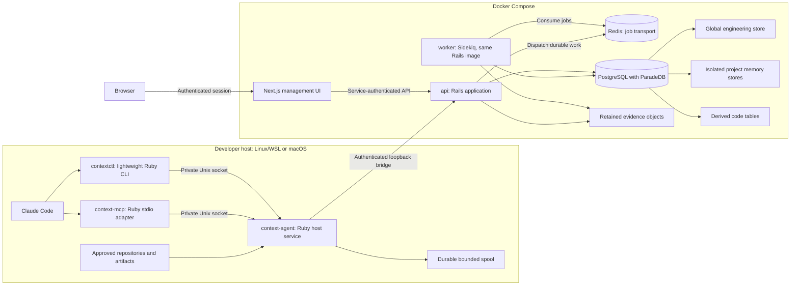
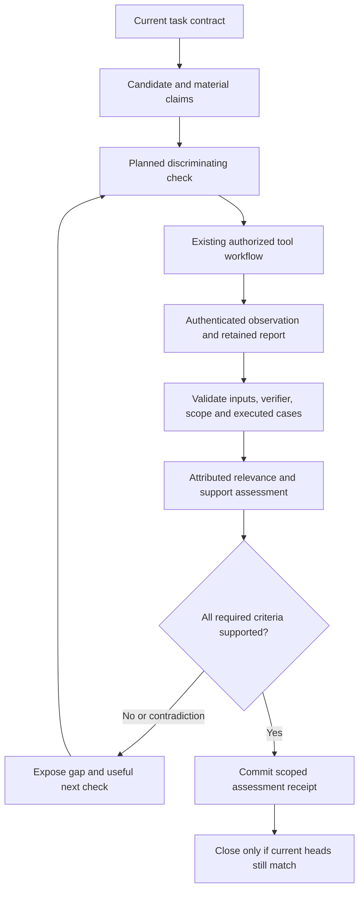

# Kioku Architectural Plan

**Status:** Proposed architecture and implementation plan  
**Date:** 15 September 2026  
**Basis:** [Evidence-Guided Memory and Problem Solving for Claude Code](claude-code-local-memory-research_v1.md), referred to below as **Research**.  
**Current state:** Design only. The workspace contains the research and repository guidance; no application, build system, or test suite exists.

## 1. Architectural recommendation

Build Kioku as a **project-based memory and evidence system with a shared global engineering store**, a Ruby on Rails backend, PostgreSQL, thin Claude Code adapters, and a Next.js management interface. Every coding project owns its task history, source evidence, corrections, failed attempts and completion records. Coding style, reusable engineering decisions, architecture patterns and preferred libraries live in the global store and are available across projects.

Run the application stack with Docker Compose: a Rails API service, a Sidekiq worker using the same backend image, PostgreSQL, Redis, and the existing Next.js UI. Use one Rails application with service classes organized by feature. Store canonical records and rebuildable code projections in PostgreSQL with explicit project ownership. Use ParadeDB inside the PostgreSQL service for full-text/BM25, Top K, highlighting, tokenizers/filters, filtering, columnar aggregates, buckets/metrics, facets and search JOINs. These capabilities are committed implementation scope. Exact primary-key lookup and relational integrity stay in PostgreSQL; typed relationships remain bounded. Retrieval is exact lookup, ParadeDB lexical/BM25 ranking and bounded typed graph traversal. Embeddings, vector search and hybrid vector/lexical fusion are out of scope; this release does not address semantic recall. Additional precision resolvers and rerankers remain conditional.

**User-selected requirements:** Ruby backend, PostgreSQL, Docker Compose, Sidekiq with Redis for background jobs, ParadeDB for all listed search/analytics capabilities, SOLID, YAGNI, DRY, KISS, service classes and a coherent folder structure. **Implementation selection:** Rails in API-only mode with Active Record and Active Job configured to use Sidekiq. Rails is the selected implementation framework; Sidekiq and Redis are explicit user requirements. Keep the existing Next.js UI. Host integration remains a small Ruby adapter package, independent of Rails boot, because Claude hooks and approved host files exist outside the application containers.

The product objective is **more successfully completed tasks with fewer unsupported claims and less repeated investigation**. Token and latency reductions are secondary measures, subject to that objective. This plan makes no measured accuracy or savings claim.

The research is design input, not authorization to run commands, install services, alter Claude configuration, or implement the product. This deliverable selects and elaborates an architecture. New engineering choices are identified as proposals; external interfaces must be qualified against pinned versions.

### Scope of the first release

| Include | Defer |
|---|---|
| Single-user installation; isolated project memories and one shared global engineering store | Remote multi-user service and cloud memory synchronization |
| A project can contain multiple repositories; repositories can have multiple worktrees | Implicit access to another project's private history |
| Claude Code on Linux/WSL and macOS | Windows-native deployment; Windows remains an authoring environment |
| Durable memories, corrections, disputes, task contracts and checkpoints | Automatic rewriting of human-maintained rules |
| Source indexing, exact lookup and bounded relationships; full ParadeDB lexical search and analytics | Separate search cluster, global graph summaries |
| Candidates, check plans, authenticated observations, scoped completion | A new autonomous repository command runner |
| Task/evidence UI, operational health, backup, restore and deletion | Arbitrary idle wakeups or continuous web research |

Language qualification should proceed in this proposed order: Markdown and TypeScript/JavaScript for the first retrieval slice, Ruby/Rails for the research's end-to-end case, then Swift and Dart syntax adapters. Publish a support matrix for each release. Advanced dispatch resolution and native platform test execution are separate capabilities.

### 1.1 Project setup and memory ownership

This project/global split is a user-directed refinement of the research's installation/repository scope model. A **project** is the coding product or workspace being worked on; it is independent of a chat, agent, branch or checkout. A backend, web client and mobile app can belong to one project. Sessions and agents working on that project share its memories, while task and worktree bindings keep unfinished work and source versions distinct.

**Global** means shared across projects in this user's Kioku installation. It does not mean public, shared with other users, or synchronized between devices.

| Destination | Records | Example |
|---|---|---|
| Project memory | Objectives, task contracts, checkpoints, bugs, attempts, observations, project corrections and completion receipts | “The invoice retry fix failed under concurrent workers in this project.” |
| Project memory | Actual project architecture, dependency versions, project ADRs and local exceptions | “This service uses PostgreSQL because its workload needs the existing extensions.” |
| Global engineering store | Coding style and conventions | “Prefer descriptive names and small functions.” |
| Global engineering store | Reusable engineering decisions and their rationale/tradeoffs | “Enforce persistence uniqueness in the database when concurrent writers can race.” |
| Global engineering store | Architecture preferences, patterns and their applicability limits | “Prefer a modular monolith for new products until service boundaries justify distribution.” |
| Global engineering store | Preferred libraries, purpose, ecosystem, alternatives and compatibility conditions | “Prefer library X for this role in TypeScript projects when its constraints fit.” |

Keep both the reusable decision and its project application when necessary. The global record says what the developer prefers or what a reusable pattern establishes; the project record says what this application actually does and why. Sharing an architecture preference never asserts that every project implements it. Project-only constraints and exceptions remain local even when their topic is style, architecture or libraries.

### 1.2 Agentic coding project setup

1. Register a stable `project_key`, display name, approved repository/root mappings and a stack profile. The profile describes languages, frameworks and platforms for matching global guidance.
2. Optionally place a minimal `.kioku/project.json` descriptor in the coding workspace with `schema_version` and `project_key`. Keep machine-specific absolute paths, credentials and memory content in Kioku's installation data. A checked-in descriptor is a discovery hint, never an access grant.
3. Bind each coding session and task to a project using the registered root/worktree mapping. An explicitly selected project must still authorize the current root. Unregistered or ambiguous roots need project setup; optional hooks return without project context until resolved rather than guessing from folder names or Git remotes.
4. Resolve applicable project instructions and the project's effective global preferences at startup. Native repository instructions stay human-maintained inputs; importing their contents does not silently turn them into global preferences.
5. Persist `project_key` in capture events, tasks, spool entries, jobs and receipts. A project switch creates a new binding/context epoch and invalidates delivery caches. Previously queued work keeps its original binding. Child agents inherit an explicit project/task binding when supported; unresolved attribution does not permit cross-project lookup.

Renaming or moving a registered project retains its identity. New worktrees of an approved repository belong to that project after root registration and keep separate source identities. An independently registered clone/fork is not merged solely because it has the same remote. In version 1, a root/worktree has one active project owner; shared components can use separately registered checkouts plus explicit cross-project contracts.

### 1.3 Global capture, project exceptions and retrieval

Use `coding_style`, `engineering_decision`, `architecture`, and `preferred_library` as global **categories**, separate from memory kind and authority. Capture directly stated reusable preferences in the global store with their original authority and evidence. Automatically extracted reusable lessons can also be stored globally as `proposed` assistant-authored records; they do not become governing user preferences because several agents repeat them. This routing policy avoids asking for confirmation on every ordinary capture.

Explicit project-only wording routes to the project store. Mixed notes split into a local application record and a global reusable record linked by provenance. Global records contain the reusable statement, rationale, applicability conditions and permitted evidence excerpt. They do not copy project logs, private paths or source wholesale. A global reference to project evidence does not grant other project contexts access to that evidence; show a restricted/unavailable source label when necessary.

Resolve authority before specificity. Within the same authority and an override-permitting policy, an explicit task/project exception wins over a global default for its declared scope. A project assertion cannot defeat a higher-authority instruction. Store overrides as links to the affected global preference and retain their reason and origin; do not modify the global record to express one project's exception. Unresolved equal-authority conflicts remain visible instead of being resolved by recency alone. A user can label a global rule mandatory; local relaxation then requires authority to amend that rule.

At retrieval, combine **the active project's authorized memories + applicable global engineering records**. Filter global entries by language, framework, version/platform constraints, status and current project exceptions. Other projects' memories are excluded by default, including their code, graph nodes and raw provenance. Explicit cross-project retrieval requires selected authorized scopes and labeled results. Global availability does not mean injecting the entire global store on every turn.

Example: Project A uses Rails and Project B uses Flutter. Both inherit a global preference for focused tests. Rails library preferences match A; Flutter preferences match B. A's failed invoice retry remains in A. A reusable concurrency lesson can be stored globally with its limitations, while B's accepted local architecture exception affects B alone.

### 1.4 Engineering principles

Store SOLID, YAGNI, DRY, KISS, service-class conventions and folder-structure conventions as user-authored global engineering preferences when memory capture is implemented. Record Ruby/PostgreSQL/Compose as Kioku's selected project stack; this request alone does not mandate converting every other project to that stack.

| Principle | Concrete rule for Kioku |
|---|---|
| SOLID — single responsibility | Controllers translate HTTP; services execute use cases; models define persistence/invariants; queries select data; jobs schedule work; adapters handle external protocols. |
| SOLID — open/closed | Introduce a small adapter boundary for an actual replaceable dependency such as a source validator or parser. Add an implementation without changing the use-case contract. |
| SOLID — Liskov substitution | Parser/validator/report adapters preserve the same scope, error and partial-result semantics; shared contract fixtures verify substitution. |
| SOLID — interface segregation | Define only the methods a caller needs, such as `validate_sources` or `parse`. Avoid a universal integration interface. |
| SOLID — dependency inversion | Services accept external collaborators explicitly through constructors or keyword arguments. Use Ruby duck typing and simple fakes; no dependency-injection framework is required. |
| YAGNI | Build one Rails application, one PostgreSQL database and the six tools. Defer microservices, event sourcing, generic workflow engines, additional brokers and pluggable everything. ParadeDB's requested capabilities share the existing database. An audit ledger does not require event sourcing. |
| DRY | Centralize scope/authority checks, idempotency, source applicability and serializers. Extract repeated behavior only when its meaning is shared; similar-looking feature code need not share an abstraction. |
| KISS | Prefer Rails conventions, explicit control flow and short transactions. Add a service for a meaningful use case, not a wrapper around every model method. Avoid speculative layers and inheritance chains. |

Apply these as review criteria rather than slogans. A new abstraction must identify the concrete responsibility or duplication it resolves. Service classes are plain Ruby objects; a generic `BaseService`, repository layer over all Active Record models, and a mandatory service-result framework are unnecessary defaults.

## 2. Governing invariants

These invariants translate Research §§5–10 and 18 into implementation obligations.

1. **Accepted records are not necessarily true.** Preserve authority, lifecycle, availability, applicability, claim support, and coverage as separate fields and assessments.
2. **Durable acknowledgment has one meaning.** `queued` means durable host enqueue; `saved` means canonical commit. A timeout or missing acknowledgment is never reported as a save.
3. **Evidence precedes its public handle.** Required object bytes must be durably stored before an available evidence reference commits.
4. **Revisions are immutable.** Corrections append attributed revisions; stale writers fail their expected-revision check. Privacy deletion is a separate lifecycle with tombstones.
5. **Scope is enforced at every boundary.** An object ID, content hash, agent ID, or graph edge grants no access by itself.
6. **Current-source claims require source checks.** Index agreement alone is insufficient. Coverage gaps, unavailable hosts, and uncertain dependencies remain visible.
7. **Completion depends on applicable evidence.** A zero-case pass, missing report, wrong environment, stale contract, or unresolved material contradiction cannot complete a required criterion.
8. **Observations and interpretations are distinct.** Authenticated capture records what happened; attributed assessments explain what it supports. Agent-supplied labels cannot manufacture a test pass.
9. **Lineage is not independent confirmation.** Repeated summaries retain shared roots. Missing identity or lineage remains unresolved.
10. **Hooks perform bounded work.** No parsing, inference, repository scans, Docker commands, or test execution on the hook path. Optional enhancement failure must allow normal Claude work to continue.
11. **Projects own their operational history.** Every task, run, source record and project memory has a stable project owner. Project switching cannot reassign queued events or expose a different project's records.
12. **Global guidance is shared with explicit applicability.** Reusable preferences remain global; actual project decisions and local overrides remain project-owned. Global storage changes visibility, not authority or evidence support.

## 3. Runtime topology and trust boundaries



| Component | Owns | Boundary |
|---|---|---|
| `contextctl` | Bounded stdin decoding, event dispatch, pairing/doctor/operator commands | stdout is event-specific output; diagnostics use stderr |
| `context-mcp` | Six versioned MCP tools, cancellation, request/receipt correlation | stdout is reserved for MCP; no storage authority |
| `context-agent` | Project/root binding, path resolution, source reads/hashes, watcher reconciliation, project-bound spool and provider event capture | Host filesystem authority stays here; no default command execution |
| Rails `api` | Project registry, preferences, application services, authorization, retrieval and task APIs | All canonical mutations use shared service contracts and PostgreSQL transactions |
| Rails `worker` | Active Job execution, parsing, reconciliation, object retention and outbox dispatch | Same application/image as API; bounded processes/queues, idempotent jobs |
| PostgreSQL `db` | Canonical rows, project/global namespaces, derived code/search tables and durable outbox/work intent | Concurrent transactions; database constraints and expected-version checks |
| Redis `redis` | Sidekiq queues, retries and scheduling | Internal-only; not a memory database or an authority for completed work |
| UI | Task workspace, evidence inspection, conflicts, operations | Uses Rails APIs; no direct database credentials |

Use proposed loopback ports `7310` for the Rails bridge/API and `7311` for the UI. PostgreSQL and Redis have no published host ports by default. The Unix socket remains on the host and is not mounted through Docker Desktop. Source files enter through the host agent; PostgreSQL data and retained objects use separate named volumes. The UI reaches Rails on the internal Compose network. The Ruby host package provides three entry points but one implementation package; none starts Rails for a hook invocation.

### 3.1 Docker Compose service contract

| Service | Image/process | Startup and persistence |
|---|---|---|
| `db` | Pinned `paradedb/paradedb` image providing PostgreSQL and search extensions | `pg_isready` healthcheck; `postgres_data` volume; installation/database roles provisioned explicitly |
| `redis` | Pinned Sidekiq-compatible Redis image | Authenticated healthcheck; `redis_data` volume; AOF persistence; dedicated queue use |
| `migrate` | Backend image, one-shot Rails migrations | Wait for healthy `db`; fail visibly on migration failure; never run migration concurrently from each replica |
| `api` | Backend image, Rails/Puma | Wait for successful `migrate`; readiness checks application/schema/database access; published only on loopback |
| `worker` | Same backend image, Sidekiq process | Wait for successful `migrate` and healthy `redis`; queue/process health, bounded concurrency, graceful shutdown and retry-safe work |
| `ui` | Pinned Next.js image | Separate healthcheck; API outages show disconnection; no effect on host/API integration |

`api` and `worker` share the retained-object volume and compatible non-root ownership. Use Compose secrets or untracked local environment configuration for credentials; commit only example configuration. Lock Ruby/gems, Node packages, PostgreSQL, Redis and images in a compatibility bundle. Docker builds install runtime dependencies so the application needs no host Rails or PostgreSQL installation. The small host adapter needs its packaged/qualified Ruby runtime; it is an integration boundary, not a second backend.

Compose dependency health/completion conditions coordinate initial startup; application reconnect, backoff and health handling cover later failures. Use a development override for source mounts and reload; production runs built images. Backups are explicit maintenance jobs against the same stack. Do not mount the Docker socket or invoke `docker exec` per hook.

**Proposed resolution of a missing transport detail:** the agent initiates a persistent authenticated control connection to the core. The core can send bounded source-validation requests back on that established connection; the host does not expose another inbound service. Multiplex request IDs, deadlines, cancellation, and reconnect epochs. Use a separately bounded upload channel for large objects. Select and qualify the concrete streaming transport in Phase 0.

A disconnected control connection yields `historical` or `unknown` applicability. Late validation responses cannot satisfy a newer request or source epoch. UI availability is independent of this channel.

## 4. Folder structure and service architecture

Group the backend's application code beneath **`context/`**, with contracts, domain, storage and related responsibilities underneath it. Use `backend/lib/context/` so paths map naturally to Ruby's `Context` namespace. Rails controllers, Active Record models and jobs retain conventional locations and delegate meaningful operations to context services. The following paths are proposed; create only folders with implemented responsibilities.

```text
kioku/
  compose.yml
  compose.override.yml.example
  .env.example
  backend/
    Gemfile
    Gemfile.lock
    Dockerfile
    app/
      controllers/api/v1/       HTTP decoding, authentication, responses
      models/                  Active Record relations and persistence validations
      jobs/                    Thin Active Job entry points
    lib/
      context/
        contracts/             Request/result types and versioned JSON schemas
          memory_write.rb      Context::Contracts::MemoryWrite
          schemas/
        domain/                Pure policy and evidence/task rules
          projects/
          memories/
          preferences/
          tasks/
          evidence/
        services/              One class per meaningful application use case
          projects/register.rb
          memories/remember.rb
          preferences/resolve.rb
          tasks/assess.rb
          tasks/close.rb
          indexing/publish.rb
          indexing/scan_repository.rb
          indexing/index_source_batch.rb
          indexing/index_commit_batch.rb
          search/retrieve.rb
        storage/               Transactional persistence operations and object access
          memory_writer.rb
          object_store.rb
          outbox_dispatcher.rb
        queries/               Authorized Active Record/PostgreSQL read queries
          search/
            scope_filter.rb
            lexical.rb
            facets.rb
            aggregates.rb
            joined.rb
        retrieval/             Candidate selection, validation and packet budgets
        indexing/              Manifests, parsers, search definitions and generation checks
        integrations/          Host protocol, report readers and external adapters
        serialization/         Shared API/MCP-facing result representations
    config/                    Rails, routes, database and loader configuration
      sidekiq.yml              Explicit queues and bounded concurrency
      initializers/sidekiq.rb   Redis client/server connection configuration
    db/
      migrate/                 Active Record migrations: canonical, derived and outbox
      structure.sql            PostgreSQL constraints, search indexes and functions
    test/
      context/                 Mirrors lib/context features
      requests/
      jobs/
      fixtures/
    bin/                       Rails and operational entry points
  frontend/                    Existing planned Next.js/shadcn management UI
    src/app/
    src/features/
      search/                  Search modes, highlights, filters and facets
      analytics/               Scoped buckets, metrics and joined evidence views
    src/lib/api/               Generated client from backend contract schemas
  integration/
    claude/
      bin/                     contextctl, context-mcp, context-agent
      lib/                     Lightweight Ruby host code; no Rails boot
      config/                  Qualified hook and MCP templates
      test/                    Host/protocol fixtures
  deploy/                      Image/service configuration and backup procedures
  eval/                        Historical tasks and matched evaluations
  docs/adr/                    Decisions, compatibility and evidence
```

Use Rails' supported `lib` autoload/eager-load configuration for the pinned release, excluding non-code directories such as schema assets. Verify filename/constant correspondence with Zeitwerk checks. For example, `context/services/memories/remember.rb` defines `Context::Services::Memories::Remember`. The root file `lib/context.rb` defines `Context` if the namespace needs explicit setup. Do not create sibling packages named `context-domain`, `context-storage`, etc.; these are internal folders in one application, not separate deployables.

Configure `config.autoload_lib(ignore: %w(assets tasks context/contracts/schemas))` for a supported Rails release and verify eager loading in both API and worker boot. Keep schemas as data files read through the contracts layer. The loader convention and supported configuration are documented in the [Rails autoloading guide](https://guides.rubyonrails.org/autoloading_and_reloading_constants.html#config-autoload-lib-ignore); this folder organization is Kioku's design choice.

### 4.1 Service-class contract

An application service represents one use case, exposes an instance `call` method with explicit keyword inputs, and accepts external collaborators through its constructor when useful. Validate the request contract, authorize its scope, apply domain rules, persist through a short transaction and return a small operation-specific result. Use explicit conflict/validation errors mapped at the HTTP/MCP boundary. Do not swallow unexpected exceptions or turn failed saves into successful results.

| Layer | Responsibility | Example |
|---|---|---|
| Controller/MCP adapter | Decode input, establish trusted actor, invoke service, render response | Memory create endpoint invokes `Context::Services::Memories::Remember` |
| Service | Coordinate one authorized use case and its transaction boundary | `Remember`, `Register`, `Assess`, `Close`, `Publish` |
| Domain | Pure decisions with explicit inputs | Effective preference resolution; evidence eligibility; completion policy |
| Model | Associations, constraints-facing validations and small persistence behavior | Project, Memory, MemoryRevision, PlannedCheck |
| Storage operation | Shared nontrivial persistence behavior | Append revision + head + receipt + outbox atomically |
| Query | Scope-aware read composition and PostgreSQL search | Project/global memory candidates with applicability filters |
| Job | Load identifiers, invoke service, retry transient failures | Indexing job delegates to publish service |

A service owns the transaction for a use case; subordinate storage methods participate in that transaction and do not independently commit half of it. Simple services can use Active Record directly. Extract a storage object for meaningful shared persistence logic or an external boundary, not an automatic one-to-one repository wrapper. Models should not trigger hidden external I/O or entire workflows through callbacks. Jobs/controllers never duplicate domain decisions.

For a memory save, `Remember` authorizes destination and evidence, stages any required object before opening the transaction, locks/checks the existing head where needed, appends the revision, updates the head/search row and writes its idempotency receipt plus outbox event. It returns `saved` only after commit. Receipt and source-validation operations use the same public service layer whether called from HTTP, MCP or a job.

### 4.2 Dependency and scheduling baseline

Use Ruby, Rails API-only, Active Record with the PostgreSQL adapter (`pg`), official `rails-paradedb`, Active Job with Sidekiq and Redis, Puma, and the official Ruby MCP SDK for the host stdio adapter. Active Record with the `pg` adapter is the ORM: no second ORM, raw-SQL data layer or repository framework sits over it. Use Ruby's standard digest support for SHA-256 content addressing; version the hash algorithm in evidence handles. Qualify a watcher library and bounded Tree-sitter CLI/native parser integration only when indexing is introduced; parsing runs in workers with time/memory limits. Keep application code in Ruby; native dependencies packaged inside ParadeDB or qualified parsers do not introduce a second application backend.

Prefer Rails' default Minitest setup and a small RuboCop rule set for naming, complexity and consistency; tests must use PostgreSQL. Pin dependencies and verify exact APIs in Phase 0. A precise parser integration or transport is a measured boundary, not a reason to create a general plugin framework.

Reserve database connections and worker capacity for foreground retrieval/validation. Bound API threads, worker processes, queue sizes and background concurrency together against PostgreSQL's connection budget. Multiple Rails processes can write concurrently; use row locks, unique constraints, optimistic revision checks and short transactions rather than one installation-wide writer. Parsing, source I/O, model work and remote waits occur outside write transactions.

Use explicit `default`, `indexing` and `maintenance` queues in `config/sidekiq.yml`, with weights/concurrency chosen from the workload. Job payloads carry stable work/project IDs and small JSON-compatible arguments, not serialized evidence bodies. Sidekiq owns the normal retry policy; avoid overlapping Active Job `retry_on` loops unless a specific case needs them. On execution, load authorized current work, check cancellation/deletion/generation state and invoke a context service. Record exhausted retries for operator inspection. Test normal retries, lease recovery and duplicate execution together.

Configure a dedicated Redis instance with AOF persistence and a named volume, a declared fsync policy, and `maxmemory-policy noeviction` so memory pressure produces visible enqueue failures rather than silent eviction. Redis is internal-only with credentials from untracked configuration/secrets. Give development/test/production separate queue instances or qualified isolated databases. Do not use the job Redis as a generic evicting application cache. The proposed every-second AOF sync policy can lose recent queue writes; canonical work reconciliation covers that gap. Keep PostgreSQL/Redis connection settings and timeout/retry budgets explicit.

## 5. Persistence and domain model

### 5.1 Authoritative and derived stores

| Store | Contents | Commit and recovery rule |
|---|---|---|
| PostgreSQL — global namespace | Shared coding style, engineering decisions, architecture patterns, preferred libraries and revisions/evidence | Durable logged tables; one global record referenced by eligible projects |
| PostgreSQL — project namespaces | Each project's events, evidence metadata, memories, tasks, assessments, local overrides, receipts and outbox | Project ownership in every read/write and relationship; canonical transactions |
| PostgreSQL — installation catalog | Principals, project/root registration, scope grants, session bindings and system metadata | Administrative scope; not automatically included in model retrieval |
| PostgreSQL — derived code/search tables | Project/repository/worktree mappings, parse versions, symbols, occurrences, search documents, typed edges and coverage | Rebuildable; publish against source epoch and index generation |
| Redis — Sidekiq state | Queued, scheduled and retry jobs; operational worker data | Persistent queue infrastructure; canonical work intent stays in PostgreSQL |
| Object directory | Source excerpts/manifests, permitted output, reports, public handoffs | Stage, hash, sync, atomically publish, then expose through committed metadata |
| Host spool | Unacknowledged events/uploads and correlation metadata | Replay with immutable producer keys; bounded quota; visible capture-loss state |
| ParadeDB indexes in PostgreSQL | Text, filter and columnar indexes over versioned search documents | Rebuildable; explicit index coverage and configuration-version checks |

An event and its canonical outbox rows commit together. A bounded dispatcher reads durable outbox rows and schedules idempotent Active Jobs; after a crash it can retry dispatch, including an uncertain enqueue acknowledgment. Track pending/dispatched/completed state and stable work keys. Reconcile unfinished work so a failed enqueue cannot lose an accepted event. Duplicate deliveries must have no duplicate domain effect. Merely using `after_commit` or Active Job's deferred enqueue does not make commit and scheduling atomic.

Configure `config.active_job.queue_adapter = :sidekiq`. Run a bounded outbox polling/reconciliation loop alongside the worker under process supervision, independently of Redis scheduling. PostgreSQL and Redis cannot share a transaction. Keep durable work IDs, completion state and expiring execution leases in PostgreSQL so recovery can redispatch lost queued/in-flight work after a grace period. Workers claim/renew leases and check generation/fencing tokens at publication; expired attempts cannot overwrite a newer result. Failed work has bounded retry limits and a visible terminal state rather than infinite reconciliation. Redis delivery and lease recovery may duplicate attempts; domain effects must remain idempotent.

**Physical storage decision:** use one PostgreSQL database with shared tables carrying explicit global/project scope. Project ownership is a domain and authorization boundary, not a separate database or a schema per project. Keep canonical and derived tables clearly named and independently rebuildable. Revision/override/outbox changes can share a transaction. Derived publication uses a separate short transaction after parsing and compares expected generations. File objects and host spool are outside the database transaction; no atomic database/filesystem claim is made. Active Record with the `pg` adapter is the ORM for canonical and derived tables alike: schema changes go through Active Record migrations under `backend/db/migrate/`, while PostgreSQL-specific constraints, search indexes and functions are captured in `backend/db/structure.sql`.

Use logged tables and keep PostgreSQL `fsync`, `full_page_writes` and `synchronous_commit` enabled for canonical durability; qualify the storage setup with crash tests. Use UUID identifiers, `timestamptz` for recorded/observed times, `jsonb` for bounded structured payloads, explicit columns for ownership and critical query fields, and `bigint` revisions/generations. Use foreign keys, check constraints and unique indexes rather than relying only on Rails validations. Nullable global ownership needs a dedicated partial unique index rather than assuming a normal unique constraint treats nulls as identical.

Implement contested updates with expected revision plus row locking or conditional updates; lock related records in a stable order and retry deadlock/serialization failures within bounded request budgets. Scope every relation/query explicitly. Use separate least-privilege application and migration roles. Row-level security is a later defense-in-depth option requiring pooled-connection/global-scope tests; it is not a substitute for scope-aware services and queries.

Use ParadeDB's `pg_search` extension and official `rails-paradedb` integration as the search implementation described in §5.4. Keep exact B-tree indexes for keys/paths and constraints. The previous native `tsvector`/`pg_trgm` search baseline is superseded; do not build a duplicate lexical stack or use the unrelated Ruby `pg_search` gem. Keep versioned search-document updates in the same canonical/publication transaction as their owner records. ParadeDB indexes those PostgreSQL rows; no external search-copy synchronization is required.

### 5.2 Domain aggregates

| Aggregate | Key relationships and rules |
|---|---|
| Installation and scope | Principal grants, global engineering namespace, project scopes, repositories, worktrees, tasks and explicit cross-project mappings |
| Project | Stable key, name, lifecycle, stack profile, registered roots and configuration revision; no identity derived only from a path |
| Session and agent | Explicit project/context binding plus provider/local identities; parentage and execution runs are independently qualified |
| Event and evidence | Immutable producer/epoch/sequence; original payload; origin role; source anchor; retained artifact |
| Memory | Explicit global/project ownership, stable head, immutable revision, evidence links, disputes, supersession and retention policy |
| Global engineering record | Category, reusable statement, rationale, applicability, default/mandatory policy, provenance and lifecycle |
| Project preference override | Project, target global record/revision, local replacement or exclusion, reason, authority and validity interval |
| Task contract | Immutable objective/constraints/criteria revision with origin and authority per requirement |
| Candidate and claim | Immutable candidate version, preconditions, material claims, contrary evidence and retry conditions |
| Planned check and observation | Exact verifier/input definition; authenticated run artifacts; normalized results and assurance |
| Assessment and receipt | Criterion support, evaluator, evidence/input vector, limitations and expected heads |
| Delivery packet | Selected revisions, rendered hash, budget, coverage and prepared/delivered status |

Translate the domain relationships from Research Appendices A, C and D into Active Record migrations in `backend/db/migrate/`; do not copy their SQLite SQL, PRAGMAs or FTS triggers. Preserve immutable revisions, ownership, composite foreign keys and evidence constraints. Add explicit tables for principals/grants, repository registration, requirement changes, claim assessments, completion receipts, evidence-to-source dependencies, object grants, idempotency receipts, outbox, deletion epochs, delivery accounting and awareness suggestions. Let Sidekiq own Redis queue/retry scheduling rather than reimplementing a general job queue; PostgreSQL outbox/work state exists only to preserve domain intent and recovery.

Extend those excerpts with `projects`, `project_roots`, versioned `session_project_bindings`, `global_preferences`, `project_preference_overrides` and a scope hierarchy containing explicit `global` and `project` kinds. Memory ownership requires exactly one destination: `store_kind='global'` with no owner project, or `store_kind='project'` with a non-null `project_key`. Origin project is separate nullable provenance metadata for global records. Enforce the discriminator, project foreign keys and matching owner scope in storage constraints plus core validation; never interpret a missing project ID as permission to fall back to global.

Tasks and project events require a project owner; global capture/administrative events use an explicit global scope and can preserve an origin project. Composite relationships prevent task/check/candidate links crossing project boundaries. Project IDs must participate in search filtering, index catalogs, object grants, packet/cache keys, jobs and idempotency request digests. A global update advances a global generation; an override/profile edit advances that project's policy generation. Packets and assessments record the exact global revisions and overrides used, so later updates invalidate only affected policy-dependent results. A global library preference is not a request to change installed dependencies.

Resolve these schema details before freezing version 1:

- Reconcile envelope names such as `event_id` with storage names such as `event_key` through documented mappings.
- Represent file/module `DEFINES` and `IMPORTS` separately from the symbol-edge excerpt, or extend the edge model explicitly; they are not present in Appendix C's edge constraint.
- Define bounded, versioned JSON schemas for source anchors, check policies and candidate payloads.
- Add indices supporting principal/scope authorization and source-dependency invalidation before ranking.
- Preserve authority-changing requirement edits as auditable proposals unless backed by the relevant user/system authority.

### 5.3 Object ownership and deletion

Content addressing permits byte deduplication; it must not expose cross-scope existence. Resolve every fetch through authorized evidence references rather than accepting a raw hash as permission. Shared physical objects need reference accounting, while each logical reference retains its own scope and retention state.

Privacy deletion removes selected content and projections, invalidates caches, increments deletion epochs, and prevents queued jobs/replays from restoring it. Purge unreferenced physical objects after checking remaining authorized retention references. Define whether a privacy request covers all references to the same bytes. Backups require a declared expiry and deletion-replay policy; restoring a pre-deletion backup must apply retained tombstones before serving data.

Archiving a project preserves its memory but excludes it from active-project selection by default. Deleting project memory does not delete independent global preferences or other projects. Global lessons derived from deleted project evidence must lose those evidence links or downgrade support; delete dependent content too where the privacy request covers it. Project export/import preserves local identities and pinned global references without silently replacing the destination installation's global defaults.

### 5.4 ParadeDB search and analytics architecture

**Decision:** use ParadeDB for every search/analytics capability requested by the user. These are capabilities of the database extension, not separate microservices. The Compose `db` service hosts application rows and ParadeDB indexes together; Redis remains exclusively the Sidekiq job transport. This removes a separate search cluster and its replication pipeline. Parsing host files, updating derived search documents and reindexing still require application work. [ParadeDB architecture overview](https://github.com/paradedb/paradedb)

#### Deployment and Rails integration

Use a pinned `paradedb/paradedb` image/digest compatible with the selected PostgreSQL major. Verify the installed `pg_search` extension before application readiness. Select a maintained ParadeDB release compatible with the pinned Rails integration; record the exact tested release rather than deploying a floating tag. Any version-dependent or beta behavior the implementation relies on must be qualified against that release before shipping, covering updates, filtering and recovery. [Docker packaging](https://github.com/paradedb/paradedb/blob/main/docker/README.md)

Use the official `rails-paradedb` gem behind `Context` query/services. Its current compatibility floor is Ruby 3.2+, Rails 7.2+, ParadeDB 0.25.0+ and PostgreSQL 15+; choose maintained compatible versions in Phase 0. Use documented Active Record methods where supported and parameterized SQL for gaps; never interpolate user text, field names or aggregate expressions into unrestricted SQL. [Official Rails integration](https://github.com/paradedb/rails-paradedb)

#### Capability-to-workflow mapping

| Requested capability | Kioku implementation | Qualification and source |
|---|---|---|
| Full-text search | Search memories, decisions, cases, permitted evidence text and code chunks using match/phrase/term routes. Exact handles still fetch directly. | Test phrase order, exact tokens and typo routes; token matching is not arbitrary substring matching. [Full-text overview](https://www.paradedb.com/docs/documentation/full-text/overview) |
| BM25 scoring | Rank textual evidence with `pdb.score` and tuned query/field importance; expose a relevance score separately from support/authority. | Use an indexed stable ID tiebreaker. Vacuum/index maintenance can affect score statistics; never treat BM25 as confidence in truth. [BM25](https://www.paradedb.com/docs/documentation/sorting/score) |
| Top K | Bound candidate and UI result sets with indexed sort fields plus `ORDER BY ... LIMIT`. | Verify `TopKScanExecState` in plans. Text sort fields need supported literal configuration; indexed tiebreakers are required. Keep within the pinned release's sort limits, currently three fields for the documented field-sort path. [Top K](https://www.paradedb.com/docs/documentation/sorting/topk) |
| Highlighting | Use `pdb.snippet`/`pdb.snippets` for bounded search cards and evidence previews after selection. | Escape source HTML and render only trusted highlight markers. Fuzzy-query highlighting is unsupported; show an ordinary labeled excerpt there. Snippets are previews, not exact evidence handles. [Highlighting](https://www.paradedb.com/docs/documentation/full-text/highlight) |
| Tokenizers and token filters | Configure prose, source code, exact identifiers and autocomplete separately; version each profile. | Use `pdb.source_code` for camel/snake splitting, literal fields for exact values and bounded ngrams where needed. Apply language-appropriate stemming/folding only to prose; test code punctuation and multilingual text. [Tokenizers](https://www.paradedb.com/docs/documentation/tokenizers/overview), [source code](https://www.paradedb.com/docs/documentation/tokenizers/available-tokenizers/source-code), [filters](https://www.paradedb.com/docs/documentation/token-filters/overview) |
| Filtering | Apply project/global scope, repository/worktree, memory kind, language, lifecycle, validity and evidence availability in the query. | Put common supported scalar filter fields in the ParadeDB index. Pushdown is a performance property; authorization remains mandatory even when PostgreSQL executes residual filters. [Filtering](https://www.paradedb.com/docs/documentation/filtering) |
| Columnar storage | Index compact IDs, ownership, categories, status, timestamps and measured numeric fields for filters/sorts/analytics. | Use columnar text/JSON only for fields needing those operations; do not duplicate every large document in columnar storage. This is an index representation, not a new canonical database. [Columnar storage](https://www.paradedb.com/docs/documentation/indexing/columnar) |
| Aggregates; buckets and metrics | Use scoped counts, category/status buckets and timestamp histograms for memory/search dashboards; numeric metrics describe captured data such as packet size or observed run duration. | Use typed allowed aggregate specifications, columnar fields and `pdb.agg` for single-table queries. Keep transaction visibility checks enabled; label approximate metric algorithms separately. [Aggregates](https://www.paradedb.com/docs/documentation/aggregates/overview) |
| Facets | Return search results with counts by kind, global/project destination, language and lifecycle. | Use the documented single-table `pdb.agg(...) OVER ()` pattern. Counts use the same authorized scope and declared matching set, not another project's records or only the displayed page. [Facets](https://www.paradedb.com/docs/documentation/aggregates/facets) |
| JOINs | Join search documents to projects, tasks, memories and evidence to inspect provenance and answer scoped multi-entity searches. | Qualify join pushdown with indexed participants, equi-join keys, filters/sorts and bounded results; otherwise retain correct native PostgreSQL execution. [JOIN overview](https://www.paradedb.com/docs/documentation/joins/overview) |

#### Search document lifecycle

Use bounded search-document rows for current memory revisions, task/case summaries and code/evidence chunks. Each row has a unique document key, owner scope/project, source record and revision, content hash, subject kind, title/body/identifier fields, relevant filter metadata and index configuration version. Preserve explicit relationships to canonical records and validate their owner at publication; a generic source reference is not permission to skip referential checks. Original artifacts stay in retained objects rather than bloating index fields.

Publish current document rows transactionally with their canonical memory change or generation-checked code publication. PostgreSQL/ParadeDB maintains indexes on those rows without a second-system sync. Derived host parsing is still asynchronous; dirty state suppresses stale current-code claims until publication. Policy-dependent eligibility is validated against current canonical state even if an indexed hint has not caught up.

An edit immediately makes the previous document row ineligible and queues its replacement through the PostgreSQL outbox. Republish only if content, owner and deletion/generation checks still match. Store the index configuration version with each row so a tokenizer or field change builds a new versioned projection instead of mixing incompatible representations.

#### Query and result contracts

The shared search contract accepts a bounded query, declared scope, approved filters, limit/cursor and optional requested facets. Lexical/BM25 is the only ranked retrieval mode; exact IDs bypass ranking, and exact error/path queries can use lexical search or direct lookup. Results return actual execution mode, candidate limits, coverage, tokenizer/index versions, source revisions and fallback reason when applicable.

Select Top K within the authorized lexical branch, then apply the existing evidence applicability/contradiction checks. If these checks remove results, refill within a bounded budget or report a partial result. A global high-scoring candidate cannot make private source evidence fetchable. Stable cursors include scope, generations and ranking configuration; changing index data may require a reset rather than promising permanent score ordering.

Use `pdb.agg` with transaction visibility for user-facing counts so deleted/updated-away rows are not counted from raw index state. Facets over lexical/filter queries describe the full declared match set. Facets computed over a bounded Top K candidate pool rather than the full match set are labeled as candidate-set counts. For zero hits, return a scoped aggregate response explicitly rather than deriving a total from a missing result row. [Aggregate visibility](https://www.paradedb.com/docs/documentation/aggregates/overview), [faceted queries](https://www.paradedb.com/docs/documentation/aggregates/facets)

For aggregate JOIN queries use supported standard SQL aggregates; `pdb.agg` and its single-table window/facet form are not pushed down across joins. Keep join keys, grouping fields and arguments indexed where acceleration is needed, and test ordinary PostgreSQL fallback for unsupported shapes. Count unique document/criterion identities where one-to-many evidence links would multiply rows. Analytics counts do not determine task completion. [Aggregate limitations](https://www.paradedb.com/docs/documentation/aggregates/limitations)

#### Implementation boundaries and acceptance

Keep one `Context::Services::Search::Retrieve` orchestrator. `Context::Queries::Search` contains lexical, facet/aggregate and joined query objects, sharing one scope/filter builder. `Context::Retrieval` retains evidence selection and packet budgets. `Context::Indexing` owns document/tokenizer/index definitions and publication. These are files inside `context/`, not new deployable services.

Each requested capability needs a useful production workflow and a regression fixture before the search release is complete. Verify tokenization examples, deterministic Top K, escaped snippets, scope-safe facets, transaction-visible counts, update/deletion visibility and JOIN result parity. Use `EXPLAIN` to confirm supported pushdown shapes; capture correct fallback and its latency separately. No benchmark claim from upstream becomes a Kioku performance guarantee.

## 6. Interface contracts

### 6.1 Common envelope

All application requests carry a schema version, request ID, bounded deadline, and requested scope. Project requests carry a `project_key` validated against the bound coding context and requested repository/worktree; global operations declare a global scope explicitly. The core derives actor identity from authenticated transport, not request text. Mutations additionally carry an actor-scoped idempotency key, request digest and expected revision where applicable.

Responses distinguish success, partial results, queued work, conflicts, unauthorized scope, unavailable source, expired/deleted evidence, quota exhaustion and deadline expiry. The exact wire error names are a Phase 0 contract deliverable.

Read results include immutable handles, revision, source/support labels, coverage, generation vector and optional bounded continuation. Continuations are bound to scope, query and expiry; they are reauthorized on use. A generation vector reports observed canonical, policy, index and host source generations; one PostgreSQL database does not make an external host file read atomic with database state.

### 6.2 Six MCP tools

| Tool | Contract to implement |
|---|---|
| `context_search` | Default to active-project memory plus applicable global records; explicit project-only/global-only modes; `solutions` exposes preconditions and rejected cases |
| `context_fetch` | Exact authorized revisions/artifacts/ranges in bounded batches; recheck access and deletion |
| `context_related` | Typed relationship queries with explicit depth, fanout and coverage limits |
| `context_remember` | Evidence-linked conclusion with explicit project/global destination and global category where relevant; can publish a reusable derivative with a source revision; idempotency and expected revision checks |
| `context_feedback` | Dispute an exact revision or record usefulness/irrelevance; preserve origin and disposition |
| `context_task` | Discriminated `get`, `set_contract`, `record_claim`, `propose`, `plan_check`, `assess`, `checkpoint`, `close` |

These are Kioku application APIs, not preexisting SDK methods. Freeze operation-specific required fields in `backend/lib/context/contracts/` before implementing adapters. Keep normalized execution observations on authenticated ingest rather than adding a model-writable `pass` operation. A model can attach or suggest an evidence association; the core validates it.

Keep six MCP tools. Project registration and root management belong to operator/UI setup APIs. Preference/override records use typed `context_remember` variants with their own permission and revision checks; `context_feedback` targets the exact project or global revision. Search responses label `store_kind`, authorized owner/origin information, category, applicability and override status. Global feedback revises/disputes the shared record; a project exception creates a local override instead. `context_task` always resolves to one project. Fetch/related reauthorize each endpoint, including project evidence behind a global record.

### 6.3 Host and UI APIs

The host protocol covers capability negotiation, durable ingest, object upload, source manifests, validation responses, health and replay acknowledgments. Pair bridge credentials to an installation and approved roots. Use separate UI-service credentials; browser sessions receive neither service secret.

The UI uses a generated typed API client and core-owned mutations. Require strong revision preconditions for existing records. Use live/no-store reads for mutable task state and version-based caching for immutable evidence. A same-origin authenticated SSE stream sends small invalidations with replay cursors; an expired cursor triggers a fresh scoped snapshot.

Validate loopback Host/Origin, mutation CSRF protections, payload size, root containment and symlink resolution. No privileged containers or Docker socket mount is needed. Imported document text, source comments, tool output and remembered content are evidence data; none can grant authority or instruct the core to execute a command.

## 7. Critical data flows

### 7.1 Capture and durable save

1. The hook client validates bounded input and forwards an envelope to the host agent.
2. The agent resolves the registered project/context binding, assigns stable producer sequence/correlation metadata and persists eligible capture with that binding to the spool. Global captures carry an explicit destination; unresolved project capture cannot be misfiled in the global store.
3. Required objects upload and become durable before available evidence metadata commits.
4. The core validates destination, project ownership, scope, origin, schema, authority, revision and evidence availability. Reusable global publication retains a derivation link and preserves the original project record.
5. A short transaction commits event/revision/head/search projection, outbox and idempotency receipt.
6. The agent acknowledges/retires spool entries only after the canonical receipt. Lost acknowledgments replay safely.

An explicit write cannot return `saved` after only step 2. Repeating the same idempotency key and payload returns the prior receipt; a different payload conflicts. Define recoverable spool eviction policy before deployment: durable unacknowledged records must not be silently discarded to make room.

### 7.2 Index and retrieve current source

1. A watcher signal marks the path dirty and invalidates affected cached applicability; reconciliation handles missed events.
2. The host reads/hashes approved saved bytes and publishes a source manifest with repository, worktree, path and epoch.
3. A worker parses by content hash, language, grammar/query revision and parse context outside transactions.
4. The index writer rejects obsolete jobs; it publishes mappings, lexical rows and qualified edges together.
5. Retrieval resolves the active project's authorized scope and matching global preferences/overrides, opens short read snapshots, gathers exact and ParadeDB BM25 candidates plus bounded typed neighbors within those scopes, records project/global generation vectors, then releases reads. Scope filters apply before candidate limits so unrelated projects cannot crowd out eligible results.
6. The core batch-validates selected dependencies through the host control channel under the caller deadline.
7. It rechecks heads, disputes and deletion state; renders evidence, material counterevidence and limits under the token budget.

Missing validation yields historical/unknown results. A new unindexed caller remains a coverage gap even when known callers match. Unsaved buffers require a separately versioned editor adapter. Do not claim complete runtime dispatch from syntax extraction.

### 7.3 Task assessment and completion



Record source manifests, environment fingerprint, verifier digest, executed cases, outcome and input assurance. Immutable snapshots and observed before/after hashes are distinct assurance levels. Preserve unknown/skipped/interrupted/infrastructure-error outcomes.

The deterministic eligibility gate rejects mismatches. Semantic relevance remains an attributed judgment that can be wrong; use adversarial fixtures to expose irrelevant passes. `close` requires a still-applicable receipt and current contract/source heads. Later relevant changes mark completion historical and identify affected criteria. Free-text Claude responses remain outside this API's enforcement boundary.

### 7.4 Context delivery and awareness

Default to pull-first retrieval. Automatic capsules identify the active project and carry changed task state, up to three applicable constraints selected from project and global guidance after override resolution, and the most consequential unresolved check or contradiction. Project and global additions share the same turn token ceiling. No addition is a valid result.

Deduplicate by item revision, assessment, session/agent and context epoch. Revalidate on resume/compaction. Preparation, attempted delivery and observed delivery are distinct; none proves model attention. Suggestions use versioned rules and evidence fingerprints, expire when obsolete, and reach the UI inbox or next eligible capsule. They do not execute checks.

### 7.5 Source and commit indexing service

**Required service:** `Context::Services::Indexing::ScanRepository` coordinates an incremental index of source code and Git history for each registered project/repository. It runs through the existing Sidekiq worker and delegates filesystem/Git reads to the authenticated host agent. This is a dedicated application service with its own jobs and contracts inside the modular monolith. It does not require another database or Compose container.

#### Responsibilities and flow

1. Project registration creates durable indexing intent. Manual rescan, saved-file watcher events, ref changes and bounded periodic reconciliation schedule later scans. Hooks only enqueue hints. The host performs enumeration/Git reads outside hook deadlines; Rails workers parse transferred approved bytes.
2. Authorize the project/root, claim a repository scan lease and capture a worktree manifest plus selected ref tips. Default to locally available branch/tag history, with configurable commit/time/byte budgets and resumable backfill. Report selected refs, truncation, missing objects and shallow history as coverage; never label a bounded scan complete for the entire repository.
3. Enumerate approved tracked files and permitted untracked source files. Apply project exclusions and content limits to both current and historical bytes. Record binaries, oversized/generated/vendor files, inaccessible paths and unsupported languages as skipped coverage. Do not traverse symlinks outside approved roots. Submodules require their own registration; LFS pointers remain pointers unless content is locally available and permitted.
4. Compare path/content hashes with the previous worktree generation. Transfer and parse changed content only; record additions, deletions and rename candidates. Reuse parsing by content hash, language and parser configuration while preserving separate project grants and source identities.
5. Enumerate newly reachable commit objects, capture metadata and parent edges, read relevant trees/blobs, and derive per-parent file changes and bounded diff chunks. Index commit messages, changed paths, permitted diff text and historical source chunks. Initial commits compare against an empty tree; merge commits preserve every parent and identify which parent a diff compares against.
6. Publish each bounded batch of source/commit rows and ParadeDB search documents in a short transaction, with idempotency keys and generation/deletion checks. Advance the resumable cursor only with committed batch state; expose progress and failures.
7. Re-read ref/worktree state after scanning. Changed tips schedule another pass. Current-code mappings publish only against the expected source generation. Historical commits stay identified by immutable object ID even when their branch moves.
8. Search and UI can retrieve code by symbol/path, search commit messages/diffs, inspect file history and join changes to evidence/tasks. Results always label worktree versus commit source, commit ID/parent where relevant, exact source range and coverage.

Use Git's read-only plumbing through a small host adapter with fixed argument arrays, bounded output/time and validated object IDs. `rev-list` enumerates reachable commits, `cat-file` reads object metadata/content, and `diff-tree` compares trees with explicit merge/rename policy. Pin and fixture-test machine-readable output, including unusual filenames; disable external diff/text-conversion execution and implicit network object retrieval. Repository content and commit text are untrusted data. [Commit enumeration](https://git-scm.com/docs/git-rev-list), [object reads](https://git-scm.com/docs/git-cat-file), [tree differences](https://git-scm.com/docs/git-diff-tree)

#### Database model

| Proposed tables | Indexed content and identity |
|---|---|
| `repository_index_runs`, `repository_index_cursors` | Project/repository, selected refs, source generation, lease/fencing token, checkpoint, limits, counts, coverage and failure state |
| `repository_refs`, `commit_ref_memberships` | Observed ref tips and versioned reachability; branch names are mutable labels |
| `git_commits`, `git_commit_parents` | Unique project/repository/object-format/OID; tree OID, ordered parent OIDs, message, attributed author/committer and timestamps |
| `git_file_changes` | Commit, compared parent, old/new path and blob OID, status, rename-detection policy and bounded change statistics |
| `source_file_versions`, `source_chunks`, `source_symbols`, `source_edges` | Content-addressed parse results and explicit worktree-generation or commit/tree/path bindings; parser version and ranges |
| Existing search documents | Searchable source/commit/diff projections with owner, revision, source link, tokenizer/index configuration and eligibility |

Git OIDs include the repository object format; do not assume a fixed SHA-1 length or confuse them with Kioku's evidence hashes. Commit author fields are reported Git metadata, not authenticated user authority. Rename detection is a heuristic, not permanent file identity.

A rebase/force-push updates ref reachability and adds newly observed commits; it does not overwrite an old commit record. Retain unreachable indexed history under a declared project retention policy and label it historical; privacy deletion still purges covered content and blocks replay. Current search defaults to current worktree source, with an explicit history mode or commit/ref filter. Commit content remains project-owned. A reusable lesson extracted from it follows the existing global publication rules.

#### Classes and jobs

- `Context::Services::Indexing::ScanRepository`: authorize and coordinate one scan.
- `Context::Services::Indexing::IndexSourceBatch`: parse/version source chunks and symbols.
- `Context::Services::Indexing::IndexCommitBatch`: materialize commit metadata, parent changes and historical chunks.
- `Context::Services::Indexing::Publish`: shared transactional publication and fencing checks.
- `Context::Indexing::GitManifest` and host `GitReader`: versioned manifests and bounded local object reads.
- Thin `RepositoryScanJob`, `SourceIndexJob` and `CommitIndexJob`: invoke services on bounded indexing queues.

**Acceptance:** An initial scan and incremental edit/commit become searchable without duplicating unchanged rows. Test two worktrees, file deletion/rename, root/merge commits, rebase, moved/deleted refs, shallow or missing history, large/binary files, interrupted pagination, duplicated jobs and deletion during a scan. Replay preserves exactly one logical published version; stale attempts cannot change active mappings. Historical code never acquires a current-source label merely because its commit is indexed.

## 8. UI architecture

Make the project workspace the entry point, with project setup/selection followed by that project's task workspace. Keep the active project visible alongside repository/worktree and task selectors plus source health. Provide criteria, candidates, check results, unresolved gaps and completion scope together.

Separate **Project memories** from **Global engineering knowledge**. The global view groups coding style, engineering decisions, architecture and preferred libraries. The project view shows inherited global guidance, applicability conditions and local overrides alongside its own records. Editors label the destination clearly; a global edit indicates that it affects all matching projects. Provide actions to save a reusable global lesson, add a project exception and inspect a record's origin. Global provenance views respect project access. Project setup registers roots and stack profile; project switching clears prior task selection and context.

The search workspace exposes lexical/BM25 search, escaped highlighted previews, filters and facets for kind, scope, language and lifecycle. Show actual execution mode, index coverage and fallback reason. Provide repository indexing progress, scanned refs, history coverage, retry/rescan controls and searchable file/commit history. Provide scoped category/time buckets and numeric metrics plus joined task/memory/evidence inspection. Label whether counts cover the full filtered match set or a bounded candidate pool; analytics never determine evidence support or completion.

Implement secondary views for memories/disputes, solution cases, evidence/lineage, agents/sessions, retrieval packets, and operations. Every evidence detail view exposes revision, provenance, source inputs, support, applicability, availability and coverage separately. A single green “verified” badge is insufficient.

Use shadcn/TanStack tables with cursor pagination and optional virtualization. Provide keyboard navigation and a list alternative to bounded graph views. Conflicting edits show the new revision and preserve the user's draft. Stream reconnection refreshes stale projections. “Plan check” and “inspect evidence” are default actions; any future execution button needs an explicitly configured authorized route.

## 9. Reliability, security and operations

| Failure | Required behavior |
|---|---|
| Core down | Optional hooks return without enhancement; bounded spool records eligible capture |
| Redis unavailable or rejects enqueue | Canonical memory save may still commit with background work marked pending; dispatcher retries within budget; UI shows delayed indexing |
| Sidekiq killed after fetching work / Redis queue loss | PostgreSQL work state and expired leases allow bounded redispatch; late attempts fail generation/fencing checks |
| Host disconnected | Retrieval explicitly qualifies source applicability; no invented current status |
| Disk/spool full | Visible failure/loss accounting; no false durable acknowledgment |
| Lost reply or duplicate delivery | Retry-safe receipt lookup; no duplicate logical mutation |
| Worker completes after source/deletion change | Reject publication using epochs/generations and deletion state |
| Unknown runner format | Preserve permitted original artifact and unknown interpretation |
| Missing identity/correlation | Retain unresolved attribution; do not infer from timing or process ID |
| Wrong-scope/deleted handle | Deny consistently across fetch, caches, graph, lexical search and aggregate/facet queries |
| Missing/ambiguous project binding | Do not attach project history or reinterpret capture as global; surface setup state |
| Project switch with pending jobs | Keep original project ownership; cancel obsolete delivery and invalidate context caches |
| Global preference changes | Refresh matching projects' effective guidance; preserve exceptions and invalidate affected policy assessments |
| Conflicting UI revision or expired cursor | Reject mutation or reload scoped snapshot |

Back up PostgreSQL with a consistent `pg_dump` while object garbage collection is paused. Restore the dump into an isolated database, enumerate object references from that restored snapshot, copy/hash-check those objects, and publish the backup manifest last. Keep garbage collection paused until the required object set is secured; handle privacy deletion during the window explicitly. Include canonical outbox/work state and ensure replay remains idempotent. Redis persistence can retain queue state, but rebuilding missing jobs from PostgreSQL is the authoritative recovery path. A named volume is persistence, not a backup; never copy live PostgreSQL data files as an ordinary file backup. Physical backups/PITR can be added for measured recovery requirements.

Record the PostgreSQL major, ParadeDB image digest, extension versions and tokenizer/index definitions in every backup manifest. Verify restoration into a fresh compatible ParadeDB database and object directory, then rebuild derived lexical and columnar indexes as needed. Migration startup excludes incompatible application versions and requires a restorable pre-migration backup. Do not promise binary rollback across an incompatible schema without restoring compatible data. Use a serialized migration job, review locking/table-rewrite cost, and qualify PostgreSQL-specific constraints/index definitions from `structure.sql`.

Ship pinned backend/UI/database images, the Ruby host adapter package, Compose configuration, contracts, migrations, compatibility matrix and `contextctl doctor`. Doctor checks Ruby/provider capabilities, PostgreSQL connectivity/version/extensions, ParadeDB index readiness and coverage, Redis/Sidekiq connectivity, schema and queue readiness, Docker connectivity, volume ownership, roots, report adapters and attribution coverage. Keep durable data outside plugin installation paths.

Local persistence does not make Claude inference local. Selected context may reach the configured model provider. External search/model adapters have explicit endpoints and are disabled in the qualified offline profile. Diagnostic logs redact content and credentials; operators can distinguish sanitized artifacts from exact retained bytes.

## 10. Performance and evaluation budgets

The following are initial targets inherited from Research §15, not demonstrated performance. Requalify them for Ruby startup, Rails/Puma, PostgreSQL and the host transport; former runtime assumptions no longer justify them. Keep Rails out of the hook CLI and use warm long-lived adapter/API processes. If measured startup or sync costs exceed the optional enhancement deadline, return no enhancement and report capture status accurately. Optimize from measurements.

| Operation | Target |
|---|---:|
| Small event to durable host spool | p95 ≤25 ms |
| Warm exact/BM25 plus bounded relationship query | Core p95 ≤50 ms |
| Ordinary prompt hook | End-to-end p95 ≤100 ms; deadline 150 ms |
| Startup/recovery | Deadline 500 ms |
| Small saved edit to lexical visibility | Goal ≤2 seconds |
| Automatic ordinary-turn capsule | 0–300 estimated tokens |
| All automatic additions per user turn | Ceiling 1,200 estimated tokens |
| Explicit search / default evidence fetch | 600–1,200 / 1,500 estimated tokens |

Measure index freshness separately from the warm exact/BM25 target. Hooks use prepared compatible results or a bounded lexical path; no dependent call may exceed their existing deadline. Start with bounded, configurable lexical candidate budgets and tune them using held-out judgments.

Start retrieval with 40 lexical candidates, ten seeds, one default relationship hop, two maximum explicit hops and 200 visited edges. Tune against held-out recall and latency. Preserve provenance and material contrary evidence when packing; narrow the answer when evidence will not fit.

Measure platform, hardware, corpus size, warm/cold state, sample count, p50/p95/p99, timeouts, RSS/CPU, queue depth and index coverage. Set object-size, spool-disk and worker-concurrency defaults from the Phase 0 workload profile; make them visible configuration rather than unbounded assumptions.

Use Research §16's 30 historical tasks as a pilot with history cutoffs and clean memory per arm. Compare native baseline, output reduction, durable memory, source grounding, full task loop, curated applicable evidence, and one optional extension at a time. Keep model/client version, budgets and permissions matched. Measure solved tasks, unsupported completion, stale claims, repeated rejected fixes, recovery, elapsed time and total tokens across failed attempts/retries. Tokens per solved task is undefined when no task is solved.

Add a two-project fixture set: reusable style reaches both projects; ecosystem-specific libraries reach only matching projects; a local override affects one project; a local bug/log/credential never appears in another project's automatic search or global excerpt. Exercise concurrent project sessions, project switching during spool replay, ambiguous roots, moved roots, independent forks, wrong-project handles, shared-object deletion and global-policy cache invalidation. Reset both project and global namespaces between independent evaluation arms; apply the same history cutoff to global lessons to prevent cross-project answer leakage.

## 11. Phased implementation plan

Each phase produces a handoff with changed files, pinned sources, contract/schema versions, decisions, verification artifacts and unresolved gaps. All implementation paths below are proposed. No build or test command has been run for this design-only task.

### Phase 0 — Documentation discovery and architecture contracts

**Implement:** Read version-matched primary docs and copy the smallest supported integration examples into qualification fixtures. Produce `docs/compatibility.md`, ADRs, application request/response schemas, scope/authority rules, workload/resource budgets and a 30-task evaluation manifest. Pin Ruby/Rails, the ParadeDB PostgreSQL image, the `pg_search` extension, `rails-paradedb`, Sidekiq/Redis, the Ruby MCP SDK and Compose requirements. Resolve the reverse source-validation transport, observation adapter, language order and privacy/backup behavior. Qualify `backend/lib/context/` loading and the standalone host package without Rails boot.

**Project deliverables:** Freeze the project descriptor/registry contract, project-versus-global routing rules, override authority model and logical namespace design in §§1.1–1.3 and 5–6. Record two distinct coding-project fixtures and their expected effective guidance. These are application contracts; no provider-native project API is assumed.

**References:** Research §§4, 10–11, 15–18 and Appendix B; upstream sources in §13 below. Appendix B is a configuration blueprint, not a compatibility guarantee.

**Exit verification:** Every external API used by the next phase has a pinned documentation/example reference; supported events and output semantics have recorded client fixtures; proposed domain helpers are clearly separate from library APIs. Baseline task inputs have no future-answer leakage.

**Guards:** Do not copy hook configuration blindly, assume all events share output contracts, or claim existing binaries/build commands. Native Windows transport is outside scope.

### Phase 1 — Transport and durable continuity

**Implement:** Scaffold the Rails API backend with the `lib/context/` structure, thin controllers/models/jobs, Next.js UI shell and Compose `db/redis/migrate/api/worker/ui` services. Implement the Ruby host package, pairing/doctor, Unix-socket clients and agent-initiated control connection. Translate identity/memory/task relationships from Appendices A and D into PostgreSQL migrations with scope, receipt and outbox additions. Add object durability, spool replay, `Remember`, preference/feedback services, contracts/checkpoints, basic search/fetch and restart recovery. Configure Active Job's Sidekiq adapter, Redis persistence and durable PostgreSQL outbox reconciliation.

**Project deliverables:** Implement project/root registration, binding epochs, required ownership constraints, isolated project namespaces, the global categories, versioned overrides and explicit global publication. Adapt research schemas to this plan's project ownership additions before using them.

**References:** Research §§4–6, 8, 17–18; Appendices A, B and D.

**Exit verification:** Lost acknowledgments replay once; same key/different payload conflicts; stale revisions fail; crash and disk-full fixtures never report false saves; unavailable UI does not interrupt integration; agent attribution remains unresolved when correlation is missing. Governing constraints survive assistant disputes with the objection visible.

**Guards:** No long-running work in the writer; no durable acknowledgment before canonical commit; no sole reliance on Stop/SessionEnd; no assistant promotion to user authority.

**Milestone:** A developer resumes a task and recovers an attributed correction and rejected attempt after a restart.

**Project acceptance:** Two projects retain different task histories while retrieving the same global coding preference. Concurrent sessions and replay preserve original owners; global capture never copies private local payloads implicitly. A project exception leaves the global revision unchanged.

**Stack acceptance:** Compose boots the pinned ParadeDB image, creates/verifies `pg_search`, and rejects incompatible versions before readiness. Compose starts from an empty volume, gates startup on successful migrations and survives database/worker restart. Concurrent PostgreSQL writes cannot duplicate revisions/receipts; a crash after domain commit but before enqueue is recovered by outbox replay. Zeitwerk resolves every `Context::*` class in both API and worker. Controllers/jobs delegate use cases and contain no duplicated authorization or completion policy. Review confirms there is no unnecessary service framework or per-model repository layer.

**Job acceptance:** Qualify Sidekiq/Redis versions, queue routing, bounded retries, graceful shutdown and a forced kill after fetch. Simulate Redis unavailability, recent queue-write loss and enqueue acknowledgment loss. PostgreSQL-backed reconciliation recovers unfinished work without duplicate domain effects, endless retries, or cross-project execution. No Sidekiq Pro/Enterprise reliability or uniqueness feature is assumed.

### Phase 2 — Source-grounded retrieval

**Implement:** Deliver the source and commit indexing service in §7.5, including incremental scans, resumable history backfill, commit/diff search and coverage reporting. Root registration, worktree identity, saved-file manifests, watcher reconciliation, bounded parsers, exact and ParadeDB BM25 retrieval, highlighting, tokenizer/filter profiles, indexed filtering, qualified relationships, source validation, packet accounting and full search/fetch/related tools. Copy Appendix C's active-mapping publication approach and Appendix E's retrieval sequence, adding complete generation/deletion checks.

**References:** Research §§9–11 and 15; Appendices C and E for domain/publication behavior translated to PostgreSQL; pinned parser documentation and all ParadeDB sources/contracts in §5.4.

**Indexer acceptance:** Pass §7.5's initial/incremental scan, history, worktree, ref rewrite, interruption and isolation fixtures. Search a changed symbol and the commit that changed it, with correctly distinct current/historical labels.

**Search acceptance:** Verify BM25/Top K ordering, tokenizer profiles, safe highlighting and consistent scope/lifecycle filters on every ranked route. Exercise stale documents, index configuration changes, retries and deletions. Record lexical retrieval quality and qualify index pushdown using the selected release's plans.

**Exit verification:** Two dirty worktrees at the same commit remain separate; stale workers cannot publish; an edited source loses current status; watcher overflow and new files produce coverage gaps; short identifiers work; scope/deletion filters hold on all routes; hook deadlines and token ceilings are measured.

**Project acceptance:** Candidate selection searches only the bound project plus eligible global entries before limits. Project/global-only modes, wrong-project fetch/related denial, stack filtering, override resolution and project/global generation invalidation all behave as specified. Shared guidance consumes the existing capsule budget.

**Guards:** No current-edge query based only on `valid = 1`; no database-only freshness check; no syntax-to-runtime completeness claim; no read transaction held while awaiting the host.

**Milestone:** Retrieve a known failed approach and current related code while correctly labeling a stale or unavailable source.

### Phase 3 — Candidate and verification loop

**Implement:** Claims, immutable candidates, planned checks, one qualified structured-report adapter, assessment policies, completion receipts and retained cases. Implement `Context::Services::Tasks::Assess` and `Close` using pure domain eligibility policies and short Active Record transactions. Translate Appendix D's composite task/contract relationships and Appendix E's assess/close contract. Proposed first observation format: a fixture-qualified JUnit XML subset with an authenticated run manifest; treat unsupported variants as unknown. Capture permitted output once, without rerunning commands.

**References:** Research §§6–7, 13 and 16; Appendices D and E; exact producer report documentation selected in Phase 0.

**Exit verification:** Reject no-criteria completion, zero-case pass, wrong verifier/environment, stale inputs, unrelated assertions, skipped/infrastructure results, material contradiction and unauthorized criterion relaxation. Show a representative retry bug progressing from candidate to scoped completion through an externally authorized run; also demonstrate an honest insufficient-evidence outcome.

**Project acceptance:** A passed check in Project A cannot complete Project B. A shared architecture lesson can inform B's candidate, but B must establish applicability and collect its own required evidence. Changes to relevant inherited policy invalidate affected assessments without automatically changing project dependencies.

**Guards:** A supplied `pass` string is not an observation; agreement is not independent evidence; before/after hashes are not an immutable snapshot; a commit or Stop event cannot close the task.

**Milestone:** The first complete product slice joins continuity, current-source evidence and defensible completion.

### Phase 4 — Management interface and awareness

**Implement:** Task workspace, candidate comparison, evidence/lineage inspector, revisions/disputes, agents, retrieval diagnostics and operations. Deliver the required ParadeDB columnar aggregates, bucket/metric dashboards, faceted search and joined evidence/task views, including scoped query APIs. Add generated client, conditional mutations, bounded SSE and deterministic suggestions. Copy the qualified shadcn table and streaming examples; adapt presentation to domain labels.

**Project deliverables:** Add project setup/switching, Project memories, Global engineering knowledge, inherited-guidance and local-override views. Verify that global edits show their shared scope, project exceptions remain local, and selecting a project never displays another project's previous task state.

**References:** Research §§12 and 14; pinned Next.js, shadcn, HTTP conditional request and SSE documentation cited by the research.

**Exit verification:** All requested ParadeDB capabilities have a working workflow and fixture. Facets distinguish full lexical matches from bounded candidate-set counts; JOINs preserve scope and avoid multiplied counts; transaction-visible aggregates exclude deleted rows. Conflicting edits preserve history; reconnect and cursor expiry refresh state; shared roots remain visible; suggestions deduplicate and expire; keyboard users can inspect all evidence without a graph; browser receives no service credential.

**Guards:** No direct DB writes, single “verified” badge, automatic execution from check text, or lifetime DB transactions for event streams.

### Phase 5 — Release qualification and final verification

**Implement:** Packaging, service lifecycle, migrations, backup/restore, privacy retention/deletion, diagnostic export and release compatibility bundle. Complete historical evaluations and the mandatory adversarial fixtures from Research §16. Inspect implemented APIs against the pinned documentation and scan relevant modules for prohibited paths.

**References:** Research §§15–18 for recovery/evaluation obligations; PostgreSQL backup/concurrency documentation, Rails/Sidekiq, Ruby MCP and Compose sources in §13 for implementation.

**Exit verification:** Restore a usable canonical ledger plus all retained reachable objects; rebuild indexes; replay deletion protections; survive interruption/disk-full/lost replies; verify scope isolation and stale-source rejection. Once implemented, run Minitest against PostgreSQL, request/service/job tests, Zeitwerk checks, RuboCop and frontend checks inside the Compose workflow using its documented commands. Build production images and verify fresh install, migration, worker recovery and backup/restore. Review service boundaries for SOLID, meaningful reuse for DRY, and unused abstractions/dependencies for YAGNI/KISS. Record platform-specific latency and matched task outcomes with limitations.

**Project acceptance:** Run the two-project isolation and inheritance suite; restore the installation's project/global relationships consistently; export/import a project without overwriting unrelated global defaults. Project deletion preserves independent global guidance and other projects while invalidating removed evidence and preventing replay resurrection.

**Guards:** No release claims based on design targets; no broad accuracy guarantee from 30 tasks; no token gain claimed by abandoning more tasks; no future-history leakage. A passing fixture suite is qualification evidence, not proof of semantic correctness.

**Search release qualification:** Restore into the compatible ParadeDB image and rebuild lexical and columnar indexes from retained versioned rows. Test the chosen extension upgrade/reindex procedure on a copy before release. Qualify version-dependent and beta features of the pinned release under concurrent updates, selective filters, interruption and recovery; record index compatibility and observed latency. Unsupported query shapes must retain correct scoped PostgreSQL fallback.

**Release gate:** All mandatory invariant fixtures pass, declared latency is qualified under measured load, and evaluation shows no demonstrated material task-correctness regression. A scope leak, false-current label or unsupported authority upgrade blocks release.

### Conditional follow-on — One extension at a time

All ParadeDB capabilities in §5.4 belong to the planned release and are not conditional extensions. Add a further language resolver, reranker or research adapter only for a documented failure that the implemented baseline does not address. Record its inputs/version manifest, benefit, resource/token cost and fallback behavior. Repeat Phase 5 verification for each adopted extension. A held-out improvement must justify added cost and complexity; an unavailable extension always leaves a useful exact and lexical path.

## 12. Decision register and first handoff

| Decision | Proposed position | Evidence needed before implementation commitment |
|---|---|---|
| Backend and folder structure | Ruby/Rails; `backend/lib/context/{contracts,domain,storage,services,...}`; thin Rails adapters | Zeitwerk, service/request tests and boundary review |
| Service granularity | One Rails application; API and worker share image; host adapter and existing UI | No additional service/framework without a demonstrated responsibility |
| Deployment | Docker Compose: PostgreSQL, Redis, one-shot migrations, API, worker and UI | Fresh-volume boot, readiness, restart and migration fixtures |
| Source and commit indexing | Dedicated Ruby service and bounded Sidekiq jobs; host-local reads, PostgreSQL projections | Incremental/backfill, merge/rebase, scope, coverage and crash fixtures in §7.5 |
| Search and analytics | ParadeDB in PostgreSQL; all §5.4 capabilities required, official Rails integration | Capability fixtures, version-dependent and beta feature qualification, scoped plans and recovery |
| Retrieval modes | Exact lookup, ParadeDB lexical/BM25 ranking and bounded typed traversal; no embeddings, vector search or hybrid fusion in scope | Lexical recall fixtures; explicit labeling of the semantic recall this release does not address |
| Canonical storage | PostgreSQL plus retained objects; Active Record with the `pg` adapter as the ORM, Active Record migrations and `structure.sql` | Transaction, concurrency, backup/restore and crash fixtures |
| Background work | Active Job/Sidekiq with Redis with durable outbox reconciliation | Commit-before-enqueue crash, duplicate delivery and recovery fixtures |
| Engineering principles | SOLID, YAGNI, DRY, KISS and plain Ruby service classes | Explicit responsibilities, minimal abstractions, shared invariant tests |
| Memory ownership | Isolated per-project namespaces and a shared global engineering namespace in one ledger | Two-project isolation, scoped export and transaction fixtures |
| Global capture | Reusable style/decisions/architecture/libraries stored globally with applicability and original authority | Classification, split-record provenance and private-content fixtures |
| Project setup | Stable registered project key; root/worktree and session bindings; optional descriptor | Rename, fork, ambiguous-root and concurrent-session fixtures |
| Preference precedence | Authority first; valid local exceptions override shared defaults within scope | Mandatory-policy, conflict and generation-invalidation fixtures |
| Core-to-host validation | Agent-initiated bidirectional control link | Cancellation, reconnect and bulk-transfer isolation prototype |
| Scope/identity | Authenticated grants; unresolved agent attribution allowed | Client fixtures and scope-isolation tests |
| Requirement edits | Attributed immutable revisions; guarded authority changes | Explicit acceptance-policy schema and drift fixtures |
| Semantic support | Attributed judgments over deterministic eligibility | Irrelevant-test and shared-lineage evaluation |
| Initial verification adapter | One versioned report format plus run manifest | Actual producer output and run-correlation fixtures |
| Language support | Progressive syntax qualification; advanced resolvers deferred | Repository-specific extraction/coverage fixtures |
| Resource limits | Visible configurable budgets | Representative corpus and hardware measurements |
| Deletion and backup | Tombstones, reference accounting, restore-time deletion replay | Defined privacy scope, retention window and recovery fixture |

**First implementation handoff:** execute Phase 0, then build the Phase 1 continuity slice. Register two projects with distinct repository roots. Save separate tasks and evidence-linked local memories, plus one shared coding preference and a project-specific exception. Survive a core restart, replay without duplication, recover each project's own history, and show inherited guidance with the exception applied only in its owner project. Demonstrate queued versus saved receipts and rejection of a wrong-project fetch. Then deliver the complete ParadeDB retrieval slice in Phase 2; a further language resolver, reranker or research adapter beyond that scope remains gated by measured benefit.

## 13. Source and verification notes

The primary architectural source is Research, especially §§4–11 for evidence boundaries/contracts, §§12–16 for product behavior and evaluation, and §§17–18 for delivery/operations. User requirements now select project/global memory ownership, Ruby, PostgreSQL, Docker Compose, Sidekiq/Redis, ParadeDB, SOLID/YAGNI/DRY/KISS, service classes and a parent `context/` folder. This plan supersedes the research's Rust/SQLite stack and coarser scope model for implementation. Appendix SQL and Rust-specific integration examples are historical design references, not implementation templates. Repository guidance in `CLAUDE.md` must reflect this precedence; the workspace remains design-only.

External interface verification is recorded below. Exact dependency pins and installed-client behavior remain Phase 0 deliverables. Research citations support architectural mechanisms; they do not establish Kioku's performance or compatibility.

| Verified surface | Allowed pattern and architectural consequence | Primary source and limit |
|---|---|---|
| Hook capture | Command hooks receive JSON on stdin. Preserve `session_id`, `hook_event_name`, `cwd` and available correlation fields. `prompt_id` is optional and documented for v2.1.196+. | [Common hook inputs](https://code.claude.com/docs/en/hooks#common-input-fields). Current documentation was checked; no installed client was exercised. |
| Context delivery | Use event-qualified `hookSpecificOutput` with `hookEventName` and `additionalContext` where supported. Revalidate recovery context on resume; transcript files can lag. | [Add context for Claude](https://code.claude.com/docs/en/hooks#add-context-for-claude). Event-specific output and size behavior still need fixtures against the selected release. |
| Compaction | `PostCompact` exposes `compact_summary` but does not control compaction. Record the new epoch and prepare next eligible recovery rather than assuming synchronous injection. | [PostCompact reference](https://code.claude.com/docs/en/hooks#postcompact). Availability must match the supported client matrix. |
| Rails API | API-only applications use `ActionController::API`; service classes are plain Ruby application code, not a separate framework. | [Rails API-only guide](https://guides.rubyonrails.org/api_app.html). Pin a maintained release and qualify middleware/authentication needs. |
| Ruby MCP | Official `mcp` SDK provides `MCP::Server` and stdio support; six tool handlers delegate through the host/API contracts. | [Official Ruby SDK](https://github.com/modelcontextprotocol/ruby-sdk), [examples](https://ruby.sdk.modelcontextprotocol.io/examples/). Pin the gem and test client handshake; main-branch examples are not a release contract. |
| Jobs | Active Job uses `queue_adapter = :sidekiq`; Sidekiq workers consume Redis jobs. Default fetching can lose in-flight work on process failure, so durable intent and reconciliation remain in PostgreSQL. | [Sidekiq Active Job](https://github.com/sidekiq/sidekiq/wiki/Active-Job), [Sidekiq reliability](https://github.com/sidekiq/sidekiq/wiki/Reliability). Pin versions and test crash/retry behavior; no commercial feature is assumed. |
| Redis | AOF persistence is configurable; an every-second sync policy can lose recent writes after a crash. A dedicated persistent instance with `noeviction` fits Sidekiq's queue use. | [Redis persistence](https://redis.io/docs/latest/operate/oss_and_stack/management/persistence/), [Sidekiq Redis configuration](https://github.com/sidekiq/sidekiq/wiki/Using-Redis). Persistent volumes/AOF reduce loss but do not replace PostgreSQL-backed work recovery. |
| ParadeDB search and analytics | Full-text/BM25, Top K, highlighting, tokenizers/filters, filtering, columnar aggregates, buckets/metrics, facets and JOINs are required. | See §5.4's capability-to-workflow mapping and primary sources. Version-dependent and beta features in the pinned release still require runtime qualification before release. |
| PostgreSQL concurrency | Row locking, constraints and bounded transaction retries protect contested updates; nullable global scope needs deliberate uniqueness constraints. | [Locking](https://www.postgresql.org/docs/current/explicit-locking.html), [constraints](https://www.postgresql.org/docs/18/ddl-constraints.html). Qualify actual migrations and queries against the chosen version. |
| PostgreSQL backup | `pg_dump` creates a consistent database backup; retained file objects need a coordinated reference manifest. | [pg_dump](https://www.postgresql.org/docs/16/app-pgdump.html), [filesystem backup limitations](https://www.postgresql.org/docs/current/backup-file.html). Restore testing is required; a named volume is not a backup. |
| Compose | `service_healthy` and `service_completed_successfully` support database/migration startup gates. | [Compose startup order](https://docs.docker.com/compose/how-tos/startup-order/). Later failures still need application reconnect/recovery. |

**Plan verification performed:** checked project/global ownership and the evidence invariants while updating runtime, PostgreSQL storage/search/concurrency, jobs, backup, Compose services, `context/` layout and phased acceptance gates. Checked primary Rails, Ruby MCP, PostgreSQL, Sidekiq, Redis, Compose and all requested ParadeDB capability documentation. No binaries, schemas, infrastructure or runtime behavior were implemented or tested. The implementation phases specify the evidence required before those claims can be made.
